# CPAI: Revised Experimental Report

A comprehensive update to the experimental section of *CPAI: A Controlled-Point Discriminant Analysis for IoT Network Intrusion Detection* with an expanded evaluation protocol (7 datasets, multi-seed, full baseline roster, statistical significance tests).

## Environment

| Category | Value |
|---|---|
| OS | macOS-26.5.1-arm64-arm-64bit-Mach-O |
| CPU | Apple M4 Pro |
| Physical cores | 12 |
| Logical cores | 12 |
| RAM | 24 GB |
| BLAS backend | Apple Accelerate |
| Python | 3.14.3 |
| numpy | 2.4.3 |
| scipy | 1.17.1 |
| scikit-learn | 1.8.0 |
| pytorch | 2.10.0 |
| lightgbm | 4.6.0 |
| pytorch-tabnet | n/a |
| tab-transformer-pytorch (FTTransformer) | n/a |

**Thread configuration for experiments**: `VECLIB_MAXIMUM_THREADS=OMP_NUM_THREADS=MKL_NUM_THREADS=6`
(limits BLAS to 6 threads per worker so 2 concurrent workers fit on 12 cores without oversubscription).

## Datasets and Preprocessing

### Data Sources and Label Remap

Seven datasets — five from the original CPAI paper plus two added for this study (Edge-IIoTset and 5G-NIDD):

| Dataset | Source | Label column (raw) | Label remap |
|---|---|---|---|
| BoT-IoT | Cyber Range Lab of UNSW Canberra | `subcategory` | Grouped into 6 classes: 0Normal, HTTP, TCP, UDP, scan (OS_Fingerprint + Service_Scan), theft (Data_Exfiltration + Keylogging) |
| IoTID20 | Dept. of Computer Science, Kyungpook National Univ. | `Target` | No remap (5 native classes: 0Normal, DoS, MITM, Mirai, Scan) |
| ToN-IoT | Cyber Range Lab of UNSW Canberra | `type` | Grouped into 8 classes: 0Normal, Malware (backdoor + ransomware), Scan, BruteForce, DDoS, WebAttack (xss + injection), DoS, MITM |
| N-BaIoT | UCI ML Repository | per-device attack subtype | 9 classes: Benign + {ack, scan, syn, udp, udpplain, combo, junk, tcp} |
| CIC-IoT2023 | Canadian Institute for Cybersecurity | `Label` | Grouped into 6 classes: 0Normal, DDoS/DoS, Mirai, Spoofing, Scan, Web |
| Edge-IIoTset | Ferrag et al. 2022 | `Attack_type` | 15 native classes preserved |
| 5G-NIDD | Samarakoon et al. 2022 | `Attack Type` | 9 native classes preserved |

### Preprocessing Pipeline

Same pipeline for every run (original CPAI procedure, `cpai/preprocessing.py::preprocess`):

1. **Load and clean**: load CSV, apply per-dataset label remap above, drop identifier/payload string columns (IPs, URIs, MACs, timestamps). Label-encode remaining object columns. Drop all-NaN feature columns (e.g., BoT-IoT MAC fields).
2. **Per-class subsampling**: sample `limit` rows per class (1 000 for all datasets except IoTID20 which uses 2 000) to produce a class-balanced dataset. Random state = 42.
3. **Impute** (IoTID20 only): replace ±∞ with NaN, then impute NaNs with column mean.
4. **Polynomial feature expansion** (conditional): when `poly > 1`, apply `PolynomialFeatures(poly, interaction_only=True)`.
5. **Stratified 80/20 split**: `train_test_split(test_size=0.2, stratify=labels, random_state=seed)`. `seed` is one of {42, 43, 44, 45, 46}.
6. **Label encoding**: `LabelEncoder` fitted on y_train, applied to y_test. `0Normal` always maps to class 0 (alphabetical sort).
7. **Scaling**: fit the chosen scaler on X_train, transform both splits, then `nan_to_num(nan=0.0)`.
8. **Per-class LOF outlier removal**: `LocalOutlierFactor(contamination=0.05)` applied separately to each attack class (class 0 / benign is passed through untouched).
9. **Form-independent (poly ≠ -1 only)**: Gaussian elimination per class to keep a linearly independent subset of training rows. Skipped when `poly = -1` (the CPAI default).

### Sample Counts

Post-preprocessing sizes with `poly = -1`, `scaler = QuantileTransformer`, `seed = 42`. The test-set size is fixed at `total × 0.2` (LOF is applied only to the training half).

| Dataset | Raw total | Per-class cap | Features | Classes | n_train (post-LOF) | n_test |
|---|---|---|---|---|---|---|
| BoT_IoT | 10,118 | 1,000 | 23 | 6 | 7,729 | 2,024 |
| IoTID20 | 10,000 | 2,000 | 79 | 5 | 7,680 | 2,000 |
| ToN_IoT | 9,597 | 1,000 | 41 | 8 | 7,333 | 1,920 |
| N_BaIoT | 9,000 | 1,000 | 115 | 9 | 6,880 | 1,800 |
| CIC_IoT2023 | 10,000 | 1,000 | 48 | 6 | 7,640 | 2,000 |
| Edge_IIoTset | 15,000 | 1,000 | 42 | 15 | 11,440 | 3,000 |
| 5G_NIDD | 9,000 | 1,000 | 48 | 9 | 6,880 | 1,800 |

## Methodology Recap

### Proposed: CPAI-OvA (HHH) and CPAI-OvR (HHHv2)

Both solve a regularized kernel ridge-regression system with a **target-assignment** mechanism (not Fisher-criterion eigenvalue optimization as in NFST / KNFST):

For training data `X` with labels `y` (`c` classes, label-encoded to {0, …, c-1}):

**CPAI-OvA (HHH)** — single discriminant direction, target = class index:
- Kernel case: α = (K + λI)⁻¹ y, where K = k(X, X)
- Linear case: α = (X Xᵀ + λI)⁻¹ y, θ = Xᵀ α
- **Predict**: `round(f(x_test))`, clipped to [min(y), max(y)]; out-of-range → −1

**CPAI-OvR (HHHv2)** — one discriminant per class, targets = one-hot rows:
- α = (K + λI)⁻¹ Y, Y ∈ {0, 1}^(n × c) is the one-hot encoded y
- **Predict**: argminⱼ |fⱼ(x) − 1|

### Default Hyperparameters

| Hyperparameter | HHH | HHHv2 | Notes |
|---|---|---|---|
| Ridge λ (kernel path) | **1e-9** | **1e-5** | Matches the original notebook. HHH's tiny ridge works because target = class index is smoother. |
| Ridge λ (linear / kernel=None path) | 1e-5 | 1e-5 | |
| Solver | scipy.linalg.solve(assume_a='pos') | same | Cholesky, multi-RHS, BLAS-threaded |
| Solver fallback | LU with ridge boost to 10⁻³ | same | Triggered on LinAlgError (singular matrix) |

### Kernels

| Kernel | Formula | Notes |
|---|---|---|
| None | K(X, Y) = X Yᵀ | Linear Gram, dual formulation |
| linear | K(x, y) = xᵀy (sklearn) | |
| poly | K(x, y) = (γxᵀy + 1)ᵈ (sklearn default) | γ = 1/d, d = 3 |
| rbf | K(x, y) = exp(-γ‖x − y‖²) (sklearn) | γ = 1/d |
| sigmoid | K(x, y) = tanh(γxᵀy + 1) (sklearn) | γ = 1/d |
| abel | K(x, y) = exp(-α‖x − y‖₂) | **α = 0.1** (matches notebook) |
| laplacian | K(x, y) = exp(-α‖x − y‖₁) | **α = 0.1** (matches notebook; different from sklearn's default γ = 1/d_features) |
| sobolev | K(x, y) = rᵏ⁻ᵈ/² · K_{k−d/2}(r), r = ‖x − y‖₂ | Bessel-K (Matérn family), **k = 0.5, d = 1** |

### Baselines

Eleven baselines, split into classical and modern/lightweight. All run with a single default configuration (no hyperparameter search) under `scaler = QuantileTransformer`, `poly = -1`. Full hyperparameter details are in the section **Baseline Default Hyperparameters** below.

*FTTransformer was tested but excluded from the final report to match the 12-baseline roster. Raw results remain in `results/baselines_default/runs/`.*

## Baseline Default Hyperparameters

All baselines are instantiated via `cpai/baselines.py::build_baseline(name)`. Only the parameters listed in the **Set** column below are passed to the constructor; every other knob uses the library default. The **Inherited defaults** column lists the most relevant ones we did **not** override so the table is self-contained.

### Classical baselines (sklearn)

| Model | Set | Inherited defaults (selected) |
|---|---|---|
| **KNN** (`KNeighborsClassifier`) | `n_neighbors=5` | `weights='uniform'`, `algorithm='auto'`, `p=2` (Euclidean), `metric='minkowski'`, `n_jobs=None` |
| **LDA** (`LinearDiscriminantAnalysis`) | `solver='svd'` | `shrinkage=None`, `priors=None`, `n_components=None`, `store_covariance=False`, `tol=1e-4` |
| **NuSVC** (`NuSVC`) | `nu=0.2`, `kernel='rbf'`, `random_state=42` | `degree=3` (unused for rbf), `gamma='scale'`, `coef0=0.0`, `shrinking=True`, `probability=False` (predict_proba falls back to Platt scaling when needed), `tol=1e-3`, `cache_size=200`, `class_weight=None`, `decision_function_shape='ovr'`, `break_ties=False` |
| **SGD** (`SGDClassifier`) | `random_state=42` | `loss='hinge'`, `penalty='l2'`, `alpha=1e-4`, `l1_ratio=0.15`, `fit_intercept=True`, `max_iter=1000`, `tol=1e-3`, `shuffle=True`, `epsilon=0.1`, `learning_rate='optimal'`, `eta0=0.0`, `power_t=0.5`, `early_stopping=False`, `class_weight=None` |
| **GauNB** (`GaussianNB`) | `var_smoothing=1e-9` | `priors=None` |
| **NC** (`NearestCentroid`) | `metric='euclidean'` | `shrink_threshold=None` |
| **RNC** (`RadiusNeighborsClassifier`) | `outlier_label='most_frequent'` | `radius=1.0`, `weights='uniform'`, `algorithm='auto'`, `leaf_size=30`, `p=2`, `metric='minkowski'`, `n_jobs=None` |
| **KNFST** (`cpai.models.KNFST`) | `kernel='rbf'` | Computes centered kernel via `sklearn.preprocessing.KernelCenterer`, dense `np.linalg.eig` for spectral basis, SVD (`eps=1e-12`) for null-space projection, argmin centroid distance at inference. No randomness — results depend only on the train/test split. |

### Modern baselines

| Model | Set | Inherited defaults (selected) |
|---|---|---|
| **LGBM** (`lightgbm.LGBMClassifier`) | `n_estimators=100`, `random_state=42`, `verbosity=-1` | `boosting_type='gbdt'`, `num_leaves=31`, `max_depth=-1` (no limit), `learning_rate=0.1`, `subsample=1.0`, `subsample_freq=0`, `colsample_bytree=1.0`, `reg_alpha=0.0`, `reg_lambda=0.0`, `objective=None` (auto multiclass), `class_weight=None`, `min_child_samples=20`, `n_jobs=-1` |
| **MLP** (`sklearn.neural_network.MLPClassifier`) | `random_state=42` | `hidden_layer_sizes=(100,)` (1 hidden layer), `activation='relu'`, `solver='adam'`, `alpha=1e-4` (L2 reg), `batch_size='auto'`, `learning_rate='constant'`, `learning_rate_init=1e-3`, `max_iter=200`, `shuffle=True`, `tol=1e-4`, `early_stopping=False`, `beta_1=0.9`, `beta_2=0.999`, `epsilon=1e-8`, `n_iter_no_change=10` |
| **TabNet** (`pytorch_tabnet.tab_model.TabNetClassifier` wrapped) | `n_d=16`, `n_a=16`, `n_steps=4`, `seed=42`, `max_epochs=50`, `patience=10`, `batch_size=256`, `virtual_batch_size=128`, `num_workers=0`, `device_name='cpu'` | `gamma=1.3` (attention relaxation), `lambda_sparse=1e-3`, `optimizer_fn=torch.optim.Adam`, `optimizer_params={'lr':0.02}`, `scheduler_fn=None`, `mask_type='sparsemax'`, `momentum=0.02`, `clip_value=None`, `drop_last=False`, `weights=0` (no class reweighting), `loss_fn=cross_entropy` |
| **SAINT** (custom implementation) | `dim=32`, `depth=3`, `heads=4`, `dim_head` (split from `dim` by heads), `dropout=0.1`, `max_epochs=30`, `batch_size=256`, `lr=1e-3`, `seed=42` | Adam optimizer, `betas=(0.9, 0.999)`, cross-entropy loss, `num_workers=0`, CPU, feature-tokenization via learnable (weight, bias) per feature, standard transformer FFN with hidden = 4×dim and GELU activation, LayerNorm before each attention sub-block |

### Notes on SAINT implementation

The `SAINTClassifier` in `cpai/baselines.py` is a from-scratch minimal implementation of Somepalli et al. (2021), not the official codebase. Concretely, each block contains:

1. **Feature-wise multi-head self-attention** over the `(batch, n_features+1, dim)` token tensor (a `[CLS]` token is prepended).
2. **Intersample multi-head self-attention** — the same tensor transposed to `(n_features+1, batch, dim)` so each feature position attends across all samples in the batch (the SAINT novelty).
3. **Position-wise FFN** of shape `(dim → 4·dim → dim)` with GELU + dropout.
4. Residual connections and LayerNorm around each sub-block.

Classification uses the `[CLS]` token after the final block, passed through `LayerNorm → Linear(dim → n_classes)`.

At inference time the intersample attention is computed over *test-set batches of `batch_size`* (no train context is injected), so predictions are deterministic given a fixed batch order and model weights.

### Removed from report

**FTTransformer** (`tab_transformer_pytorch.FTTransformer`) was evaluated (`dim=32`, `depth=3`, `heads=4`, `dim_head=16`, `max_epochs=30`, `batch_size=256`, `lr=1e-3`, `seed=42`) but is excluded from all tables and statistical tests in this report. Its raw JSONs are preserved in `results/baselines_default/runs/*FTTransformer*.json` if needed.

## Evaluation Metrics

All metrics below are computed per run (one per seed) and aggregated as mean ± standard deviation over five seeds.

| Metric | Definition | Notes |
|---|---|---|
| MCC | Matthews Correlation Coefficient | Range [-1, 1]; robust to class imbalance |
| ACC | (TP + TN) / all, aggregated (micro) across classes | |
| TPR macro | mean recall across classes | |
| TPR weighted | recall weighted by class support | |
| PPV macro | mean precision across classes | |
| PPV weighted | precision weighted by class support | |
| F1 macro | mean F1 across classes | Reported as percentage |
| F1 weighted | F1 weighted by class support | |
| FPR | aggregated FP / (FP + TN) across classes | |
| AUROC OvR macro | one-vs-rest multiclass AUROC, unweighted mean | Requires predict_proba |
| AUROC OvR weighted | one-vs-rest multiclass AUROC, support-weighted mean | |
| AUROC OvO macro | one-vs-one multiclass AUROC, unweighted mean | |
| AUROC binary | binary attack-vs-benign AUROC using score = 1 - P(class 0) | Benign is always class 0 (`0Normal`) |
| Train time (s) | wall-clock of `model.fit(X_train, y_train)` only | Excludes preprocessing |
| Test time (s) | wall-clock of `model.predict` + `model.predict_proba` | Excludes preprocessing |

## Kernel Study — CPAI-OvA (HHH) and CPAI-OvR (HHHv2)

For each dataset × kernel × model cell, the best `(scaler, poly)` configuration is selected by mean MCC over five seeds. Values are **mean ± std** across those five seeds.

### Paper-Format Multiseed Summary (Table 2 / Table 3 analog)

Mirrors the layout of the original paper's Tables 2 (CPAI-OvA) and 3 (CPAI-OvR): rows are kernels, super-columns are datasets, with `ACC` (%), `TPR macro` (%), and `FPR` (%) sub-columns per dataset. Each cell is `mean (std)` across 5 seeds; the best `(scaler, poly)` per `(dataset, kernel)` cell is selected by mean MCC.

### CPAI-OvA (HHH) — Multiseed Summary (mean (std) over 5 seeds, best `(scaler, poly)` per cell)

| Kernel | BoT_IoT ACC | BoT_IoT TPR | BoT_IoT FPR | IoTID20 ACC | IoTID20 TPR | IoTID20 FPR | ToN_IoT ACC | ToN_IoT TPR | ToN_IoT FPR | N_BaIoT ACC | N_BaIoT TPR | N_BaIoT FPR | CIC_IoT2 ACC | CIC_IoT2 TPR | CIC_IoT2 FPR | Edge_IIo ACC | Edge_IIo TPR | Edge_IIo FPR | 5G_NIDD ACC | 5G_NIDD TPR | 5G_NIDD FPR |
|---|---|---|---|---|---|---|---|---|---|---|---|---|---|---|---|---|---|---|---|---|---|
| None | 99.68 (0.09) | 84.56 (0.26) | 0.189 (0.050) | 82.42 (0.17) | 39.38 (0.42) | 10.550 (0.101) | 83.88 (0.32) | 19.36 (1.66) | 9.070 (0.182) | 87.55 (0.24) | 33.99 (1.06) | 6.915 (0.131) | 95.49 (1.01) | 68.28 (3.61) | 2.628 (0.590) | 90.95 (0.02) | 25.89 (0.18) | 4.826 (0.013) | 88.59 (0.23) | 38.65 (1.03) | 6.340 (0.128) |
| linear | 99.70 (0.04) | 84.62 (0.11) | 0.178 (0.024) | 82.46 (0.18) | 39.49 (0.45) | 10.522 (0.107) | 83.59 (0.22) | 19.63 (0.85) | 9.230 (0.122) | 86.92 (0.08) | 31.16 (0.36) | 7.264 (0.044) | 95.35 (1.07) | 68.09 (3.28) | 2.710 (0.623) | 89.56 (0.52) | 17.94 (1.97) | 5.579 (0.291) | 88.78 (0.33) | 39.51 (1.48) | 6.233 (0.183) |
| poly | 99.71 (0.06) | 84.80 (0.15) | 0.168 (0.034) | 88.98 (0.31) | 55.77 (0.78) | 6.614 (0.186) | 92.43 (0.26) | 54.36 (0.89) | 4.258 (0.147) | 98.28 (0.06) | 82.25 (0.26) | 0.957 (0.032) | 99.79 (0.04) | 84.90 (0.12) | 0.120 (0.023) | 92.37 (0.08) | 36.54 (0.61) | 4.068 (0.043) | 97.67 (0.13) | 79.51 (0.59) | 1.295 (0.073) |
| rbf | 99.65 (0.11) | 98.89 (0.36) | 0.211 (0.064) | 89.46 (0.24) | 56.98 (0.59) | 6.324 (0.141) | 96.72 (0.21) | 75.16 (0.88) | 1.845 (0.118) | 99.01 (0.12) | 85.56 (0.54) | 0.548 (0.067) | 99.84 (0.02) | 85.06 (0.09) | 0.095 (0.013) | 94.40 (0.08) | 51.76 (0.60) | 2.986 (0.043) | 98.06 (0.12) | 81.26 (0.55) | 1.079 (0.067) |
| sigmoid | 97.07 (0.54) | 74.65 (1.97) | 1.708 (0.317) | 82.80 (1.44) | 40.33 (3.59) | 10.320 (0.863) | 88.25 (1.21) | 40.98 (4.25) | 6.609 (0.681) | 91.78 (1.66) | 52.99 (7.46) | 4.569 (0.921) | 97.38 (2.74) | 73.38 (13.34) | 1.528 (1.596) | 91.81 (0.12) | 32.35 (0.88) | 4.366 (0.063) | 95.51 (0.75) | 69.81 (3.38) | 2.493 (0.417) |
| abel | 99.68 (0.11) | 98.96 (0.35) | 0.192 (0.063) | 95.48 (0.56) | 78.71 (7.79) | 2.762 (0.406) | 98.81 (0.15) | 88.23 (5.66) | 0.674 (0.088) | 98.79 (0.12) | 90.54 (5.00) | 0.679 (0.071) | 99.75 (0.03) | 98.93 (0.17) | 0.152 (0.019) | 95.61 (0.07) | 60.81 (0.52) | 2.342 (0.037) | 99.39 (0.10) | 93.24 (5.11) | 0.344 (0.060) |
| laplacian | 99.96 (0.04) | 99.86 (0.09) | 0.024 (0.022) | 97.43 (0.20) | 76.90 (0.49) | 1.544 (0.118) | 99.25 (0.05) | 85.59 (0.31) | 0.424 (0.031) | 99.50 (0.11) | 87.75 (0.51) | 0.278 (0.062) | 99.91 (0.03) | 99.60 (0.17) | 0.054 (0.017) | 95.10 (0.13) | 56.99 (0.95) | 2.614 (0.068) | 99.40 (0.08) | 95.28 (4.22) | 0.339 (0.045) |
| sobolev | 97.79 (0.23) | 92.43 (0.65) | 1.326 (0.137) | 89.60 (0.26) | 74.00 (0.65) | 6.500 (0.164) | 94.79 (0.09) | 76.69 (0.47) | 2.978 (0.051) | 92.67 (0.16) | 67.01 (0.72) | 4.124 (0.090) | 96.39 (0.12) | 82.52 (0.64) | 2.166 (0.074) | 90.64 (0.08) | 29.81 (0.59) | 5.014 (0.042) | 95.16 (0.26) | 78.21 (1.16) | 2.724 (0.145) |

### CPAI-OvR (HHHv2) — Multiseed Summary (mean (std) over 5 seeds, best `(scaler, poly)` per cell)

| Kernel | BoT_IoT ACC | BoT_IoT TPR | BoT_IoT FPR | IoTID20 ACC | IoTID20 TPR | IoTID20 FPR | ToN_IoT ACC | ToN_IoT TPR | ToN_IoT FPR | N_BaIoT ACC | N_BaIoT TPR | N_BaIoT FPR | CIC_IoT2 ACC | CIC_IoT2 TPR | CIC_IoT2 FPR | Edge_IIo ACC | Edge_IIo TPR | Edge_IIo FPR | 5G_NIDD ACC | 5G_NIDD TPR | 5G_NIDD FPR |
|---|---|---|---|---|---|---|---|---|---|---|---|---|---|---|---|---|---|---|---|---|---|
| None | 99.92 (0.03) | 99.76 (0.09) | 0.047 (0.019) | 90.96 (0.28) | 77.39 (0.69) | 5.652 (0.173) | 95.89 (0.06) | 76.69 (0.14) | 2.348 (0.034) | 97.04 (0.11) | 86.67 (0.52) | 1.667 (0.065) | 98.52 (0.41) | 92.76 (1.97) | 0.890 (0.248) | 94.22 (0.08) | 56.67 (0.58) | 3.095 (0.041) | 98.49 (0.13) | 93.20 (0.58) | 0.850 (0.073) |
| linear | 99.92 (0.04) | 99.74 (0.15) | 0.049 (0.026) | 90.96 (0.28) | 77.40 (0.70) | 5.650 (0.176) | 95.89 (0.06) | 76.69 (0.14) | 2.348 (0.034) | 97.04 (0.11) | 86.67 (0.52) | 1.667 (0.065) | 98.71 (0.23) | 93.81 (0.93) | 0.772 (0.141) | 94.23 (0.09) | 56.71 (0.69) | 3.092 (0.049) | 98.49 (0.13) | 93.20 (0.58) | 0.850 (0.073) |
| poly | 99.83 (0.05) | 99.39 (0.24) | 0.101 (0.027) | 93.38 (0.39) | 83.46 (0.97) | 4.135 (0.242) | 98.83 (0.17) | 95.05 (0.74) | 0.667 (0.098) | 99.42 (0.17) | 97.40 (0.77) | 0.325 (0.097) | 99.93 (0.04) | 99.80 (0.19) | 0.040 (0.025) | 97.21 (0.10) | 79.05 (0.78) | 1.497 (0.055) | 99.68 (0.05) | 98.57 (0.23) | 0.179 (0.029) |
| rbf | 99.83 (0.04) | 99.55 (0.10) | 0.103 (0.022) | 94.29 (0.22) | 85.72 (0.54) | 3.570 (0.136) | 99.23 (0.12) | 96.71 (0.58) | 0.438 (0.070) | 99.72 (0.15) | 98.76 (0.67) | 0.156 (0.084) | 99.94 (0.04) | 99.81 (0.19) | 0.036 (0.024) | 97.52 (0.10) | 81.37 (0.78) | 1.331 (0.056) | 99.77 (0.04) | 98.94 (0.16) | 0.132 (0.020) |
| sigmoid | 99.47 (0.15) | 98.47 (0.53) | 0.316 (0.088) | 85.25 (4.53) | 63.12 (11.31) | 9.220 (2.828) | 95.85 (2.87) | 82.35 (11.53) | 2.371 (1.638) | 94.06 (2.42) | 73.28 (10.91) | 3.340 (1.364) | 98.73 (1.20) | 94.10 (5.87) | 0.762 (0.723) | 94.38 (0.32) | 57.87 (2.43) | 3.010 (0.174) | 96.92 (1.12) | 86.13 (5.06) | 1.733 (0.632) |
| abel | 99.87 (0.04) | 99.68 (0.11) | 0.075 (0.026) | 95.99 (0.21) | 89.98 (0.53) | 2.505 (0.134) | 99.42 (0.08) | 97.41 (0.28) | 0.332 (0.044) | 99.86 (0.08) | 99.36 (0.35) | 0.081 (0.044) | 99.90 (0.07) | 99.59 (0.36) | 0.060 (0.044) | 97.55 (0.03) | 81.65 (0.21) | 1.311 (0.015) | 99.79 (0.04) | 99.04 (0.18) | 0.119 (0.023) |
| laplacian | 100.00 (0.00) | 100.00 (0.00) | 0.000 (0.000) | 98.15 (0.15) | 95.37 (0.38) | 1.158 (0.095) | 99.80 (0.04) | 99.09 (0.16) | 0.112 (0.023) | 99.88 (0.05) | 99.48 (0.24) | 0.065 (0.030) | 99.99 (0.01) | 99.95 (0.07) | 0.006 (0.009) | 98.55 (0.04) | 89.13 (0.33) | 0.776 (0.023) | 99.90 (0.02) | 99.56 (0.08) | 0.056 (0.010) |
| sobolev | 99.78 (0.05) | 99.36 (0.15) | 0.134 (0.028) | 95.38 (0.08) | 88.44 (0.20) | 2.890 (0.050) | 99.25 (0.05) | 96.86 (0.34) | 0.430 (0.030) | 99.55 (0.08) | 97.97 (0.38) | 0.254 (0.048) | 99.74 (0.05) | 98.81 (0.24) | 0.156 (0.027) | 97.13 (0.05) | 78.47 (0.40) | 1.538 (0.029) | 99.70 (0.02) | 98.66 (0.10) | 0.168 (0.012) |

### Per-Metric Detail Tables

Same data, broken out one metric at a time so each table fits a normal viewport.

### CPAI-OvA (HHH)

#### Accuracy (ACC %) — best `(scaler, poly)` per cell

| Kernel | BoT_IoT | IoTID20 | ToN_IoT | N_BaIoT | CIC_IoT2023 | Edge_IIoTset | 5G_NIDD |
|---|---|---|---|---|---|---|---|
| None | 99.68±0.09 | 82.42±0.17 | 83.88±0.32 | 87.55±0.24 | 95.49±1.01 | 90.95±0.02 | 88.59±0.23 |
| linear | 99.70±0.04 | 82.46±0.18 | 83.59±0.22 | 86.92±0.08 | 95.35±1.07 | 89.56±0.52 | 88.78±0.33 |
| poly | 99.71±0.06 | 88.98±0.31 | 92.43±0.26 | 98.28±0.06 | 99.79±0.04 | 92.37±0.08 | 97.67±0.13 |
| rbf | 99.65±0.11 | 89.46±0.24 | 96.72±0.21 | 99.01±0.12 | 99.84±0.02 | 94.40±0.08 | 98.06±0.12 |
| sigmoid | 97.07±0.54 | 82.80±1.44 | 88.25±1.21 | 91.78±1.66 | 97.38±2.74 | 91.81±0.12 | 95.51±0.75 |
| abel | 99.68±0.11 | 95.48±0.56 | 98.81±0.15 | 98.79±0.12 | 99.75±0.03 | 95.61±0.07 | 99.39±0.10 |
| laplacian | 99.96±0.04 | 97.43±0.20 | 99.25±0.05 | 99.50±0.11 | 99.91±0.03 | 95.10±0.13 | 99.40±0.08 |
| sobolev | 97.79±0.23 | 89.60±0.26 | 94.79±0.09 | 92.67±0.16 | 96.39±0.12 | 90.64±0.08 | 95.16±0.26 |

#### Matthews Correlation Coefficient (MCC)

| Kernel | BoT_IoT | IoTID20 | ToN_IoT | N_BaIoT | CIC_IoT2023 | Edge_IIoTset | 5G_NIDD |
|---|---|---|---|---|---|---|---|
| None | 0.9862±0.0036 | 0.3635±0.0056 | 0.1964±0.0171 | 0.3126±0.0129 | 0.7831±0.0476 | 0.2367±0.0025 | 0.3665±0.0128 |
| linear | 0.9870±0.0017 | 0.3657±0.0061 | 0.1505±0.0119 | 0.2770±0.0049 | 0.7775±0.0493 | 0.1374±0.0233 | 0.3775±0.0186 |
| poly | 0.9878±0.0025 | 0.6050±0.0113 | 0.6138±0.0132 | 0.9059±0.0030 | 0.9897±0.0019 | 0.3553±0.0073 | 0.8715±0.0072 |
| rbf | 0.9872±0.0039 | 0.6248±0.0087 | 0.8341±0.0102 | 0.9448±0.0067 | 0.9919±0.0011 | 0.5245±0.0069 | 0.8928±0.0066 |
| sigmoid | 0.8801±0.0212 | 0.3890±0.0479 | 0.4077±0.0593 | 0.5546±0.0894 | 0.8725±0.1311 | 0.3062±0.0105 | 0.7539±0.0407 |
| abel | 0.9884±0.0038 | 0.8444±0.0065 | 0.9408±0.0047 | 0.9364±0.0035 | 0.9892±0.0014 | 0.6261±0.0060 | 0.9679±0.0042 |
| laplacian | 0.9986±0.0013 | 0.9040±0.0073 | 0.9604±0.0029 | 0.9720±0.0063 | 0.9961±0.0012 | 0.5836±0.0110 | 0.9690±0.0031 |
| sobolev | 0.9198±0.0082 | 0.6843±0.0078 | 0.7615±0.0038 | 0.6403±0.0080 | 0.8465±0.0053 | 0.2532±0.0061 | 0.7585±0.0129 |

#### F1 macro (%)

| Kernel | BoT_IoT | IoTID20 | ToN_IoT | N_BaIoT | CIC_IoT2023 | Edge_IIoTset | 5G_NIDD |
|---|---|---|---|---|---|---|---|
| None | 84.76±0.27 | 35.26±0.53 | 15.59±1.37 | 30.56±1.22 | 67.29±3.79 | 21.25±0.44 | 38.24±1.07 |
| linear | 84.82±0.08 | 35.37±0.61 | 18.28±1.09 | 28.52±0.47 | 66.98±3.57 | 13.98±1.33 | 39.08±1.41 |
| poly | 84.90±0.13 | 56.33±0.80 | 53.41±0.95 | 82.82±0.33 | 84.99±0.11 | 33.75±0.76 | 79.89±0.64 |
| rbf | 98.90±0.34 | 59.72±0.62 | 77.57±0.94 | 85.96±0.44 | 85.12±0.10 | 50.77±0.50 | 81.95±0.59 |
| sigmoid | 77.69±1.48 | 42.73±3.01 | 40.17±4.14 | 53.60±7.90 | 74.79±12.33 | 28.71±0.91 | 69.74±3.52 |
| abel | 99.07±0.31 | 78.78±7.79 | 87.99±5.57 | 90.56±4.99 | 98.86±0.15 | 59.15±0.57 | 93.23±5.10 |
| laplacian | 99.88±0.09 | 77.06±0.44 | 85.58±0.29 | 87.80±0.49 | 99.58±0.15 | 55.99±0.99 | 95.26±4.20 |
| sobolev | 93.34±0.62 | 73.84±0.67 | 75.67±0.68 | 61.77±0.62 | 82.81±0.61 | 24.82±0.68 | 77.73±1.26 |

#### TPR macro (%)

| Kernel | BoT_IoT | IoTID20 | ToN_IoT | N_BaIoT | CIC_IoT2023 | Edge_IIoTset | 5G_NIDD |
|---|---|---|---|---|---|---|---|
| None | 84.56±0.26 | 39.38±0.42 | 19.36±1.66 | 33.99±1.06 | 68.28±3.61 | 25.89±0.18 | 38.65±1.03 |
| linear | 84.62±0.11 | 39.49±0.45 | 19.63±0.85 | 31.16±0.36 | 68.09±3.28 | 17.94±1.97 | 39.51±1.48 |
| poly | 84.80±0.15 | 55.77±0.78 | 54.36±0.89 | 82.25±0.26 | 84.90±0.12 | 36.54±0.61 | 79.51±0.59 |
| rbf | 98.89±0.36 | 56.98±0.59 | 75.16±0.88 | 85.56±0.54 | 85.06±0.09 | 51.76±0.60 | 81.26±0.55 |
| sigmoid | 74.65±1.97 | 40.33±3.59 | 40.98±4.25 | 52.99±7.46 | 73.38±13.34 | 32.35±0.88 | 69.81±3.38 |
| abel | 98.96±0.35 | 78.71±7.79 | 88.23±5.66 | 90.54±5.00 | 98.93±0.17 | 60.81±0.52 | 93.24±5.11 |
| laplacian | 99.86±0.09 | 76.90±0.49 | 85.59±0.31 | 87.75±0.51 | 99.60±0.17 | 56.99±0.95 | 95.28±4.22 |
| sobolev | 92.43±0.65 | 74.00±0.65 | 76.69±0.47 | 67.01±0.72 | 82.52±0.64 | 29.81±0.59 | 78.21±1.16 |

#### FPR (%)

| Kernel | BoT_IoT | IoTID20 | ToN_IoT | N_BaIoT | CIC_IoT2023 | Edge_IIoTset | 5G_NIDD |
|---|---|---|---|---|---|---|---|
| None | 0.189±0.050 | 10.550±0.101 | 9.070±0.182 | 6.915±0.131 | 2.628±0.590 | 4.826±0.013 | 6.340±0.128 |
| linear | 0.178±0.024 | 10.522±0.107 | 9.230±0.122 | 7.264±0.044 | 2.710±0.623 | 5.579±0.291 | 6.233±0.183 |
| poly | 0.168±0.034 | 6.614±0.186 | 4.258±0.147 | 0.957±0.032 | 0.120±0.023 | 4.068±0.043 | 1.295±0.073 |
| rbf | 0.211±0.064 | 6.324±0.141 | 1.845±0.118 | 0.548±0.067 | 0.095±0.013 | 2.986±0.043 | 1.079±0.067 |
| sigmoid | 1.708±0.317 | 10.320±0.863 | 6.609±0.681 | 4.569±0.921 | 1.528±1.596 | 4.366±0.063 | 2.493±0.417 |
| abel | 0.192±0.063 | 2.762±0.406 | 0.674±0.088 | 0.679±0.071 | 0.152±0.019 | 2.342±0.037 | 0.344±0.060 |
| laplacian | 0.024±0.022 | 1.544±0.118 | 0.424±0.031 | 0.278±0.062 | 0.054±0.017 | 2.614±0.068 | 0.339±0.045 |
| sobolev | 1.326±0.137 | 6.500±0.164 | 2.978±0.051 | 4.124±0.090 | 2.166±0.074 | 5.014±0.042 | 2.724±0.145 |

#### Best `(scaler, poly)` picked per cell

| Kernel | BoT_IoT | IoTID20 | ToN_IoT | N_BaIoT | CIC_IoT2023 | Edge_IIoTset | 5G_NIDD |
|---|---|---|---|---|---|---|---|
| None | (Quan, p=2) | (MinM, p=-1) | (Stan, p=0) | (Quan, p=-1) | (Quan, p=-1) | (Quan, p=-1) | (MinM, p=-1) |
| linear | (Quan, p=2) | (MinM, p=-1) | (Stan, p=-1) | (MinM, p=-1) | (Quan, p=-1) | (Quan, p=0) | (MinM, p=-1) |
| poly | (Quan, p=2) | (MinM, p=-1) | (Stan, p=-1) | (MinM, p=-1) | (MinM, p=-1) | (Stan, p=-1) | (MinM, p=-1) |
| rbf | (Quan, p=0) | (Stan, p=-1) | (Quan, p=-1) | (Quan, p=-1) | (MinM, p=-1) | (Quan, p=-1) | (MinM, p=-1) |
| sigmoid | (Quan, p=-1) | (MinM, p=-1) | (MinM, p=-1) | (MinM, p=-1) | (MinM, p=-1) | (MinM, p=-1) | (MinM, p=-1) |
| abel | (Quan, p=-1) | (MinM, p=-1) | (MinM, p=-1) | (Quan, p=-1) | (MinM, p=-1) | (Quan, p=0) | (Stan, p=-1) |
| laplacian | (MinM, p=-1) | (MinM, p=-1) | (Stan, p=0) | (MinM, p=-1) | (MinM, p=-1) | (Quan, p=0) | (Stan, p=-1) |
| sobolev | (MinM, p=-1) | (MinM, p=-1) | (MinM, p=-1) | (MinM, p=-1) | (MinM, p=-1) | (Quan, p=0) | (MinM, p=-1) |

### CPAI-OvR (HHHv2)

#### Accuracy (ACC %) — best `(scaler, poly)` per cell

| Kernel | BoT_IoT | IoTID20 | ToN_IoT | N_BaIoT | CIC_IoT2023 | Edge_IIoTset | 5G_NIDD |
|---|---|---|---|---|---|---|---|
| None | 99.92±0.03 | 90.96±0.28 | 95.89±0.06 | 97.04±0.11 | 98.52±0.41 | 94.22±0.08 | 98.49±0.13 |
| linear | 99.92±0.04 | 90.96±0.28 | 95.89±0.06 | 97.04±0.11 | 98.71±0.23 | 94.23±0.09 | 98.49±0.13 |
| poly | 99.83±0.05 | 93.38±0.39 | 98.83±0.17 | 99.42±0.17 | 99.93±0.04 | 97.21±0.10 | 99.68±0.05 |
| rbf | 99.83±0.04 | 94.29±0.22 | 99.23±0.12 | 99.72±0.15 | 99.94±0.04 | 97.52±0.10 | 99.77±0.04 |
| sigmoid | 99.47±0.15 | 85.25±4.53 | 95.85±2.87 | 94.06±2.42 | 98.73±1.20 | 94.38±0.32 | 96.92±1.12 |
| abel | 99.87±0.04 | 95.99±0.21 | 99.42±0.08 | 99.86±0.08 | 99.90±0.07 | 97.55±0.03 | 99.79±0.04 |
| laplacian | 100.00±0.00 | 98.15±0.15 | 99.80±0.04 | 99.88±0.05 | 99.99±0.01 | 98.55±0.04 | 99.90±0.02 |
| sobolev | 99.78±0.05 | 95.38±0.08 | 99.25±0.05 | 99.55±0.08 | 99.74±0.05 | 97.13±0.05 | 99.70±0.02 |

#### Matthews Correlation Coefficient (MCC)

| Kernel | BoT_IoT | IoTID20 | ToN_IoT | N_BaIoT | CIC_IoT2023 | Edge_IIoTset | 5G_NIDD |
|---|---|---|---|---|---|---|---|
| None | 0.9971±0.0012 | 0.7194±0.0089 | 0.8096±0.0031 | 0.8542±0.0056 | 0.9365±0.0177 | 0.5412±0.0064 | 0.9242±0.0065 |
| linear | 0.9970±0.0016 | 0.7196±0.0090 | 0.8096±0.0031 | 0.8542±0.0056 | 0.9451±0.0099 | 0.5415±0.0076 | 0.9242±0.0065 |
| poly | 0.9939±0.0017 | 0.7945±0.0121 | 0.9456±0.0080 | 0.9708±0.0087 | 0.9971±0.0018 | 0.7765±0.0083 | 0.9839±0.0026 |
| rbf | 0.9938±0.0013 | 0.8220±0.0067 | 0.9642±0.0057 | 0.9860±0.0075 | 0.9974±0.0017 | 0.8011±0.0083 | 0.9881±0.0018 |
| sigmoid | 0.9808±0.0053 | 0.5433±0.1395 | 0.8089±0.1303 | 0.7024±0.1231 | 0.9458±0.0513 | 0.5503±0.0261 | 0.8453±0.0563 |
| abel | 0.9954±0.0016 | 0.8751±0.0067 | 0.9729±0.0036 | 0.9928±0.0040 | 0.9957±0.0032 | 0.8037±0.0023 | 0.9893±0.0020 |
| laplacian | 1.0000±0.0000 | 0.9422±0.0048 | 0.9909±0.0019 | 0.9941±0.0027 | 0.9996±0.0006 | 0.8838±0.0035 | 0.9950±0.0009 |
| sobolev | 0.9918±0.0017 | 0.8587±0.0025 | 0.9649±0.0025 | 0.9772±0.0043 | 0.9889±0.0019 | 0.7701±0.0042 | 0.9849±0.0011 |

#### F1 macro (%)

| Kernel | BoT_IoT | IoTID20 | ToN_IoT | N_BaIoT | CIC_IoT2023 | Edge_IIoTset | 5G_NIDD |
|---|---|---|---|---|---|---|---|
| None | 99.77±0.10 | 77.63±0.65 | 75.47±0.23 | 84.93±0.64 | 92.91±1.92 | 52.62±0.56 | 93.20±0.59 |
| linear | 99.76±0.14 | 77.64±0.66 | 75.47±0.23 | 84.93±0.64 | 93.68±1.04 | 52.65±0.64 | 93.20±0.59 |
| poly | 99.40±0.24 | 83.56±1.00 | 94.96±0.76 | 97.38±0.79 | 99.75±0.17 | 78.76±0.76 | 98.57±0.23 |
| rbf | 99.56±0.10 | 85.68±0.56 | 96.73±0.58 | 98.75±0.68 | 99.77±0.17 | 81.24±0.71 | 98.95±0.16 |
| sigmoid | 98.54±0.49 | 61.70±12.80 | 81.46±12.30 | 72.30±11.05 | 94.02±6.02 | 57.53±2.75 | 85.97±5.05 |
| abel | 99.65±0.12 | 90.00±0.53 | 97.50±0.32 | 99.36±0.35 | 99.57±0.33 | 81.55±0.19 | 99.05±0.18 |
| laplacian | 100.00±0.00 | 95.38±0.38 | 99.08±0.17 | 99.48±0.24 | 99.95±0.07 | 89.15±0.32 | 99.56±0.08 |
| sobolev | 99.36±0.14 | 88.59±0.20 | 96.77±0.34 | 97.97±0.38 | 98.77±0.20 | 78.21±0.33 | 98.66±0.10 |

#### TPR macro (%)

| Kernel | BoT_IoT | IoTID20 | ToN_IoT | N_BaIoT | CIC_IoT2023 | Edge_IIoTset | 5G_NIDD |
|---|---|---|---|---|---|---|---|
| None | 99.76±0.09 | 77.39±0.69 | 76.69±0.14 | 86.67±0.52 | 92.76±1.97 | 56.67±0.58 | 93.20±0.58 |
| linear | 99.74±0.15 | 77.40±0.70 | 76.69±0.14 | 86.67±0.52 | 93.81±0.93 | 56.71±0.69 | 93.20±0.58 |
| poly | 99.39±0.24 | 83.46±0.97 | 95.05±0.74 | 97.40±0.77 | 99.80±0.19 | 79.05±0.78 | 98.57±0.23 |
| rbf | 99.55±0.10 | 85.72±0.54 | 96.71±0.58 | 98.76±0.67 | 99.81±0.19 | 81.37±0.78 | 98.94±0.16 |
| sigmoid | 98.47±0.53 | 63.12±11.31 | 82.35±11.53 | 73.28±10.91 | 94.10±5.87 | 57.87±2.43 | 86.13±5.06 |
| abel | 99.68±0.11 | 89.98±0.53 | 97.41±0.28 | 99.36±0.35 | 99.59±0.36 | 81.65±0.21 | 99.04±0.18 |
| laplacian | 100.00±0.00 | 95.37±0.38 | 99.09±0.16 | 99.48±0.24 | 99.95±0.07 | 89.13±0.33 | 99.56±0.08 |
| sobolev | 99.36±0.15 | 88.44±0.20 | 96.86±0.34 | 97.97±0.38 | 98.81±0.24 | 78.47±0.40 | 98.66±0.10 |

#### FPR (%)

| Kernel | BoT_IoT | IoTID20 | ToN_IoT | N_BaIoT | CIC_IoT2023 | Edge_IIoTset | 5G_NIDD |
|---|---|---|---|---|---|---|---|
| None | 0.047±0.019 | 5.652±0.173 | 2.348±0.034 | 1.667±0.065 | 0.890±0.248 | 3.095±0.041 | 0.850±0.073 |
| linear | 0.049±0.026 | 5.650±0.176 | 2.348±0.034 | 1.667±0.065 | 0.772±0.141 | 3.092±0.049 | 0.850±0.073 |
| poly | 0.101±0.027 | 4.135±0.242 | 0.667±0.098 | 0.325±0.097 | 0.040±0.025 | 1.497±0.055 | 0.179±0.029 |
| rbf | 0.103±0.022 | 3.570±0.136 | 0.438±0.070 | 0.156±0.084 | 0.036±0.024 | 1.331±0.056 | 0.132±0.020 |
| sigmoid | 0.316±0.088 | 9.220±2.828 | 2.371±1.638 | 3.340±1.364 | 0.762±0.723 | 3.010±0.174 | 1.733±0.632 |
| abel | 0.075±0.026 | 2.505±0.134 | 0.332±0.044 | 0.081±0.044 | 0.060±0.044 | 1.311±0.015 | 0.119±0.023 |
| laplacian | 0.000±0.000 | 1.158±0.095 | 0.112±0.023 | 0.065±0.030 | 0.006±0.009 | 0.776±0.023 | 0.056±0.010 |
| sobolev | 0.134±0.028 | 2.890±0.050 | 0.430±0.030 | 0.254±0.048 | 0.156±0.027 | 1.538±0.029 | 0.168±0.012 |

#### Best `(scaler, poly)` picked per cell

| Kernel | BoT_IoT | IoTID20 | ToN_IoT | N_BaIoT | CIC_IoT2023 | Edge_IIoTset | 5G_NIDD |
|---|---|---|---|---|---|---|---|
| None | (Quan, p=2) | (Quan, p=-1) | (Quan, p=-1) | (Quan, p=-1) | (Quan, p=-1) | (Quan, p=-1) | (Stan, p=-1) |
| linear | (Quan, p=2) | (Quan, p=-1) | (Quan, p=-1) | (Quan, p=-1) | (Quan, p=0) | (Quan, p=-1) | (Stan, p=-1) |
| poly | (Stan, p=0) | (Stan, p=-1) | (Quan, p=-1) | (Quan, p=-1) | (MinM, p=-1) | (Quan, p=-1) | (MinM, p=-1) |
| rbf | (MinM, p=0) | (Quan, p=-1) | (Quan, p=0) | (Quan, p=-1) | (MinM, p=0) | (Quan, p=-1) | (Stan, p=-1) |
| sigmoid | (MinM, p=-1) | (Stan, p=-1) | (Stan, p=-1) | (Stan, p=-1) | (MinM, p=-1) | (Stan, p=-1) | (MinM, p=0) |
| abel | (Quan, p=-1) | (MinM, p=-1) | (MinM, p=-1) | (Quan, p=-1) | (MinM, p=-1) | (Quan, p=-1) | (Stan, p=-1) |
| laplacian | (MinM, p=-1) | (MinM, p=0) | (MinM, p=-1) | (MinM, p=-1) | (MinM, p=-1) | (Quan, p=-1) | (MinM, p=-1) |
| sobolev | (Quan, p=-1) | (MinM, p=-1) | (MinM, p=-1) | (Quan, p=-1) | (MinM, p=-1) | (Quan, p=-1) | (Stan, p=-1) |

## Baseline Comparison — Per-Dataset Tables with Statistical Tests

For every dataset we show mean ± std across five seeds of the following metrics:
**MCC, ACC (%), TPR macro (%), FPR (%), PPV macro (%), F1 macro (%)**. Both CPAI models use the configuration (kernel, scaler, poly) with the highest mean MCC; baselines use the fixed default configuration (QuantileTransformer, poly = -1).

**Statistical tests**: for every `(CPAI model, baseline)` pair we run a paired test across the five seeds comparing the MCC values and report two p-values — paired t-test (`p_t`) and Wilcoxon signed-rank (`p_w`). Lower p-value ⇒ stronger evidence that CPAI differs from the baseline. `p<0.05` is commonly used as the significance threshold. When CPAI beats the baseline by a non-zero margin for every seed the Wilcoxon test returns `p≈0.0625` (the lowest achievable p-value with n = 5 paired samples).

### BoT_IoT

| Model | MCC | ACC | TPR | FPR | PPV | F1 | p_t vs OvA | p_w vs OvA | p_t vs OvR | p_w vs OvR |
|---|---|---|---|---|---|---|---|---|---|---|
| KNN | 0.9927 ± 0.0014 | 99.80 ± 0.04 | 99.47 ± 0.12 | 0.121 ± 0.024 | 99.44 ± 0.13 | 99.45 ± 0.12 | 0.002 | 0.062 | 0.000 | 0.062 |
| LDA | 0.9959 ± 0.0015 | 99.89 ± 0.04 | 99.72 ± 0.10 | 0.067 ± 0.025 | 99.72 ± 0.10 | 99.72 ± 0.10 | 0.051 | 0.062 | 0.004 | 0.062 |
| NuSVC | 0.9448 ± 0.0044 | 98.47 ± 0.12 | 95.89 ± 0.37 | 0.917 ± 0.073 | 96.29 ± 0.31 | 95.99 ± 0.34 | 0.000 | 0.062 | 0.000 | 0.062 |
| SGD | 0.9920 ± 0.0023 | 99.78 ± 0.06 | 99.33 ± 0.26 | 0.132 ± 0.037 | 99.45 ± 0.15 | 99.39 ± 0.20 | 0.012 | 0.062 | 0.001 | 0.062 |
| GauNB | 0.9812 ± 0.0060 | 99.48 ± 0.16 | 98.57 ± 0.47 | 0.310 ± 0.099 | 98.71 ± 0.41 | 98.63 ± 0.44 | 0.004 | 0.062 | 0.002 | 0.062 |
| NC | 0.8960 ± 0.0038 | 97.09 ± 0.11 | 90.14 ± 0.71 | 1.747 ± 0.068 | 93.52 ± 0.23 | 91.22 ± 0.55 | 0.000 | 0.062 | 0.000 | 0.062 |
| RNC | 0.9480 ± 0.0079 | 98.54 ± 0.23 | 94.38 ± 0.84 | 0.875 ± 0.136 | 96.99 ± 0.38 | 95.34 ± 0.70 | 0.000 | 0.062 | 0.000 | 0.062 |
| KNFST | 0.9911 ± 0.0035 | 99.76 ± 0.10 | 99.20 ± 0.36 | 0.146 ± 0.057 | 99.36 ± 0.27 | 99.27 ± 0.32 | 0.022 | 0.062 | 0.005 | 0.062 |
| LGBM | 0.9988 ± 0.0013 | 99.97 ± 0.03 | 99.92 ± 0.09 | 0.020 ± 0.021 | 99.92 ± 0.09 | 99.92 ± 0.09 | 0.804 | 0.812 | 0.103 | 0.250 |
| MLP | 0.9958 ± 0.0029 | 99.88 ± 0.08 | 99.68 ± 0.22 | 0.069 ± 0.048 | 99.65 ± 0.21 | 99.67 ± 0.21 | 0.110 | 0.125 | 0.032 | 0.062 |
| TabNet | 0.9990 ± 0.0009 | 99.97 ± 0.02 | 99.93 ± 0.06 | 0.016 ± 0.015 | 99.90 ± 0.10 | 99.91 ± 0.08 | 0.566 | 0.438 | 0.078 | 0.125 |
| SAINT | 0.9973 ± 0.0058 | 99.92 ± 0.16 | 99.80 ± 0.43 | 0.045 ± 0.096 | 99.68 ± 0.69 | 99.73 ± 0.58 | 0.673 | 0.625 | 0.350 | 0.500 |
| **CPAI-OvA (HHH)** — laplacian, MinMaxScaler, poly=-1 | 0.9986 ± 0.0013 | 99.96 ± 0.04 | 99.86 ± 0.09 | 0.024 ± 0.022 | 99.89 ± 0.10 | 99.88 ± 0.09 | — | — | — | — |
| **CPAI-OvR (HHHv2)** — laplacian, MinMaxScaler, poly=-1 | 1.0000 ± 0.0000 | 100.00 ± 0.00 | 100.00 ± 0.00 | 0.000 ± 0.000 | 100.00 ± 0.00 | 100.00 ± 0.00 | — | — | — | — |

### IoTID20

| Model | MCC | ACC | TPR | FPR | PPV | F1 | p_t vs OvA | p_w vs OvA | p_t vs OvR | p_w vs OvR |
|---|---|---|---|---|---|---|---|---|---|---|
| KNN | 0.8094 ± 0.0106 | 93.85 ± 0.34 | 84.63 ± 0.84 | 3.842 ± 0.211 | 85.32 ± 0.84 | 84.68 ± 0.83 | 0.000 | 0.062 | 0.000 | 0.062 |
| LDA | 0.7176 ± 0.0102 | 90.86 ± 0.32 | 77.16 ± 0.81 | 5.710 ± 0.202 | 79.60 ± 0.82 | 77.71 ± 0.74 | 0.000 | 0.062 | 0.000 | 0.062 |
| NuSVC | 0.7363 ± 0.0217 | 91.52 ± 0.69 | 78.81 ± 1.73 | 5.298 ± 0.433 | 79.55 ± 1.85 | 78.95 ± 1.76 | 0.000 | 0.062 | 0.000 | 0.062 |
| SGD | 0.6828 ± 0.0668 | 89.19 ± 2.80 | 72.97 ± 6.99 | 6.758 ± 1.748 | 78.17 ± 4.83 | 71.69 ± 9.55 | 0.002 | 0.062 | 0.001 | 0.062 |
| GauNB | 0.5352 ± 0.0056 | 82.80 ± 0.69 | 56.99 ± 1.72 | 10.753 ± 0.431 | 75.19 ± 2.04 | 54.89 ± 3.28 | 0.000 | 0.062 | 0.000 | 0.062 |
| NC | 0.4145 ± 0.0129 | 80.94 ± 0.40 | 52.34 ± 1.00 | 11.915 ± 0.250 | 49.22 ± 1.26 | 47.85 ± 0.97 | 0.000 | 0.062 | 0.000 | 0.062 |
| RNC | 0.7273 ± 0.0104 | 91.10 ± 0.35 | 77.76 ± 0.87 | 5.560 ± 0.217 | 80.20 ± 0.68 | 77.73 ± 0.89 | 0.000 | 0.062 | 0.000 | 0.062 |
| KNFST | 0.3943 ± 0.0253 | 80.36 ± 0.85 | 50.90 ± 2.13 | 12.275 ± 0.533 | 49.95 ± 3.06 | 48.44 ± 2.99 | 0.000 | 0.062 | 0.000 | 0.062 |
| LGBM | 0.9388 ± 0.0070 | 98.04 ± 0.22 | 95.09 ± 0.56 | 1.228 ± 0.140 | 95.17 ± 0.59 | 95.10 ± 0.56 | 0.004 | 0.062 | 0.426 | 0.625 |
| MLP | 0.8100 ± 0.0203 | 93.90 ± 0.65 | 84.75 ± 1.63 | 3.812 ± 0.407 | 84.96 ± 1.78 | 84.73 ± 1.71 | 0.000 | 0.062 | 0.000 | 0.062 |
| TabNet | 0.8602 ± 0.0138 | 95.40 ± 0.46 | 88.49 ± 1.16 | 2.878 ± 0.290 | 90.10 ± 1.06 | 88.58 ± 1.24 | 0.001 | 0.062 | 0.000 | 0.062 |
| SAINT | 0.8864 ± 0.0050 | 96.29 ± 0.16 | 90.73 ± 0.39 | 2.317 ± 0.097 | 91.70 ± 0.48 | 90.81 ± 0.40 | 0.027 | 0.062 | 0.000 | 0.062 |
| **CPAI-OvA (HHH)** — laplacian, MinMaxScaler, poly=-1 | 0.9040 ± 0.0073 | 97.43 ± 0.20 | 76.90 ± 0.49 | 1.544 ± 0.118 | 77.33 ± 0.40 | 77.06 ± 0.44 | — | — | — | — |
| **CPAI-OvR (HHHv2)** — laplacian, MinMaxScaler, poly=0 | 0.9422 ± 0.0048 | 98.15 ± 0.15 | 95.37 ± 0.38 | 1.158 ± 0.095 | 95.40 ± 0.39 | 95.38 ± 0.38 | — | — | — | — |

### ToN_IoT

| Model | MCC | ACC | TPR | FPR | PPV | F1 | p_t vs OvA | p_w vs OvA | p_t vs OvR | p_w vs OvR |
|---|---|---|---|---|---|---|---|---|---|---|
| KNN | 0.9671 ± 0.0049 | 99.30 ± 0.11 | 96.84 ± 0.66 | 0.402 ± 0.060 | 97.18 ± 0.52 | 96.99 ± 0.58 | 0.013 | 0.062 | 0.000 | 0.062 |
| LDA | 0.8810 ± 0.0089 | 97.45 ± 0.19 | 87.89 ± 1.07 | 1.460 ± 0.110 | 88.36 ± 1.02 | 87.90 ± 1.02 | 0.000 | 0.062 | 0.000 | 0.062 |
| NuSVC | 0.9014 ± 0.0073 | 97.89 ± 0.16 | 88.99 ± 1.04 | 1.205 ± 0.089 | 91.94 ± 0.76 | 90.16 ± 0.91 | 0.000 | 0.062 | 0.000 | 0.062 |
| SGD | 0.8632 ± 0.0206 | 97.02 ± 0.47 | 83.10 ± 4.57 | 1.704 ± 0.270 | 87.51 ± 3.37 | 83.35 ± 3.80 | 0.000 | 0.062 | 0.000 | 0.062 |
| GauNB | 0.4888 ± 0.0070 | 88.26 ± 0.15 | 54.26 ± 0.76 | 6.710 ± 0.084 | 56.16 ± 1.88 | 44.46 ± 1.44 | 0.000 | 0.062 | 0.000 | 0.062 |
| NC | 0.3579 ± 0.0199 | 84.97 ± 0.47 | 46.64 ± 1.57 | 8.586 ± 0.270 | 53.61 ± 2.44 | 37.11 ± 2.28 | 0.000 | 0.062 | 0.000 | 0.062 |
| RNC | 0.9138 ± 0.0074 | 98.14 ± 0.16 | 90.44 ± 0.88 | 1.062 ± 0.092 | 94.56 ± 0.47 | 92.11 ± 0.75 | 0.000 | 0.062 | 0.000 | 0.062 |
| KNFST | 0.9193 ± 0.0065 | 98.26 ± 0.14 | 93.28 ± 0.69 | 0.996 ± 0.081 | 91.85 ± 0.64 | 92.29 ± 0.71 | 0.000 | 0.062 | 0.000 | 0.062 |
| LGBM | 0.9889 ± 0.0034 | 99.76 ± 0.07 | 98.92 ± 0.35 | 0.135 ± 0.041 | 98.94 ± 0.33 | 98.91 ± 0.34 | 0.000 | 0.062 | 0.296 | 0.625 |
| MLP | 0.9690 ± 0.0042 | 99.34 ± 0.09 | 97.17 ± 0.34 | 0.379 ± 0.052 | 97.23 ± 0.54 | 97.18 ± 0.43 | 0.019 | 0.062 | 0.000 | 0.062 |
| TabNet | 0.9652 ± 0.0062 | 99.25 ± 0.13 | 96.52 ± 0.71 | 0.427 ± 0.076 | 96.73 ± 0.48 | 96.57 ± 0.56 | 0.124 | 0.125 | 0.001 | 0.062 |
| SAINT | 0.9813 ± 0.0024 | 99.60 ± 0.05 | 98.24 ± 0.25 | 0.229 ± 0.030 | 98.09 ± 0.26 | 98.15 ± 0.24 | 0.000 | 0.062 | 0.000 | 0.062 |
| **CPAI-OvA (HHH)** — laplacian, StandardScaler, poly=0 | 0.9604 ± 0.0029 | 99.25 ± 0.05 | 85.59 ± 0.31 | 0.424 ± 0.031 | 85.61 ± 0.29 | 85.58 ± 0.29 | — | — | — | — |
| **CPAI-OvR (HHHv2)** — laplacian, MinMaxScaler, poly=-1 | 0.9909 ± 0.0019 | 99.80 ± 0.04 | 99.09 ± 0.16 | 0.112 ± 0.023 | 99.07 ± 0.19 | 99.08 ± 0.17 | — | — | — | — |

### N_BaIoT

| Model | MCC | ACC | TPR | FPR | PPV | F1 | p_t vs OvA | p_w vs OvA | p_t vs OvR | p_w vs OvR |
|---|---|---|---|---|---|---|---|---|---|---|
| KNN | 0.9761 ± 0.0048 | 99.53 ± 0.10 | 97.87 ± 0.43 | 0.267 ± 0.053 | 97.91 ± 0.42 | 97.86 ± 0.43 | 0.320 | 0.438 | 0.001 | 0.062 |
| LDA | 0.8751 ± 0.0066 | 97.45 ± 0.13 | 88.51 ± 0.60 | 1.436 ± 0.075 | 89.84 ± 0.53 | 86.87 ± 0.74 | 0.000 | 0.062 | 0.000 | 0.062 |
| NuSVC | 0.9683 ± 0.0082 | 99.37 ± 0.16 | 97.18 ± 0.73 | 0.353 ± 0.091 | 97.22 ± 0.71 | 97.18 ± 0.72 | 0.305 | 0.625 | 0.001 | 0.062 |
| SGD | 0.8917 ± 0.0385 | 97.79 ± 0.82 | 90.06 ± 3.69 | 1.243 ± 0.461 | 92.18 ± 1.88 | 89.76 ± 3.86 | 0.012 | 0.062 | 0.005 | 0.062 |
| GauNB | 0.6863 ± 0.0527 | 93.57 ± 1.03 | 71.08 ± 4.63 | 3.615 ± 0.579 | 70.87 ± 6.01 | 67.48 ± 5.32 | 0.000 | 0.062 | 0.000 | 0.062 |
| NC | 0.4232 ± 0.0168 | 88.03 ± 0.31 | 46.13 ± 1.41 | 6.733 ± 0.176 | 34.86 ± 2.49 | 36.41 ± 1.96 | 0.000 | 0.062 | 0.000 | 0.062 |
| RNC | 0.6805 ± 0.0128 | 92.96 ± 0.31 | 68.32 ± 1.37 | 3.960 ± 0.172 | 88.95 ± 0.17 | 70.89 ± 1.34 | 0.000 | 0.062 | 0.000 | 0.062 |
| KNFST | 0.8954 ± 0.0150 | 97.92 ± 0.27 | 90.62 ± 1.23 | 1.172 ± 0.154 | 90.98 ± 1.73 | 90.49 ± 1.07 | 0.000 | 0.062 | 0.000 | 0.062 |
| LGBM | 0.9951 ± 0.0025 | 99.90 ± 0.05 | 99.57 ± 0.23 | 0.054 ± 0.028 | 99.57 ± 0.22 | 99.57 ± 0.23 | 0.001 | 0.062 | 0.491 | 0.625 |
| MLP | 0.9862 ± 0.0081 | 99.73 ± 0.16 | 98.77 ± 0.72 | 0.154 ± 0.091 | 98.81 ± 0.69 | 98.77 ± 0.73 | 0.015 | 0.062 | 0.050 | 0.125 |
| TabNet | 0.9611 ± 0.0194 | 99.21 ± 0.40 | 96.44 ± 1.81 | 0.444 ± 0.226 | 97.14 ± 1.29 | 96.35 ± 1.88 | 0.351 | 0.438 | 0.023 | 0.062 |
| SAINT | 0.9904 ± 0.0049 | 99.81 ± 0.10 | 99.14 ± 0.44 | 0.107 ± 0.055 | 99.17 ± 0.42 | 99.14 ± 0.44 | 0.006 | 0.062 | 0.160 | 0.188 |
| **CPAI-OvA (HHH)** — laplacian, MinMaxScaler, poly=-1 | 0.9720 ± 0.0063 | 99.50 ± 0.11 | 87.75 ± 0.51 | 0.278 ± 0.062 | 87.91 ± 0.44 | 87.80 ± 0.49 | — | — | — | — |
| **CPAI-OvR (HHHv2)** — laplacian, MinMaxScaler, poly=-1 | 0.9941 ± 0.0027 | 99.88 ± 0.05 | 99.48 ± 0.24 | 0.065 ± 0.030 | 99.49 ± 0.24 | 99.48 ± 0.24 | — | — | — | — |

### CIC_IoT2023

| Model | MCC | ACC | TPR | FPR | PPV | F1 | p_t vs OvA | p_w vs OvA | p_t vs OvR | p_w vs OvR |
|---|---|---|---|---|---|---|---|---|---|---|
| KNN | 0.9565 ± 0.0036 | 98.98 ± 0.08 | 95.08 ± 0.46 | 0.610 ± 0.050 | 95.45 ± 0.63 | 95.20 ± 0.53 | 0.000 | 0.062 | 0.000 | 0.062 |
| LDA | 0.3268 ± 0.0617 | 78.67 ± 7.30 | 33.33 ± 0.00 | 12.800 ± 4.382 | 21.48 ± 4.06 | 23.43 ± 4.69 | 0.000 | 0.062 | 0.000 | 0.062 |
| NuSVC | 0.9100 ± 0.0092 | 97.88 ± 0.22 | 89.51 ± 1.11 | 1.270 ± 0.130 | 97.24 ± 0.29 | 92.66 ± 0.75 | 0.000 | 0.062 | 0.000 | 0.062 |
| SGD | 0.9838 ± 0.0024 | 99.62 ± 0.06 | 98.15 ± 0.30 | 0.228 ± 0.034 | 98.33 ± 0.28 | 98.21 ± 0.29 | 0.001 | 0.062 | 0.000 | 0.062 |
| GauNB | 0.9976 ± 0.0013 | 99.94 ± 0.03 | 99.74 ± 0.13 | 0.034 ± 0.018 | 99.83 ± 0.16 | 99.78 ± 0.13 | 0.129 | 0.188 | 0.038 | 0.062 |
| NC | 0.5836 ± 0.0109 | 88.01 ± 0.34 | 70.13 ± 1.22 | 7.194 ± 0.201 | 66.99 ± 0.83 | 64.35 ± 1.12 | 0.000 | 0.062 | 0.000 | 0.062 |
| RNC | 0.6867 ± 0.0046 | 92.61 ± 0.11 | 63.05 ± 0.54 | 4.434 ± 0.064 | 94.88 ± 0.05 | 69.95 ± 0.67 | 0.000 | 0.062 | 0.000 | 0.062 |
| KNFST | 0.9756 ± 0.0100 | 99.43 ± 0.24 | 97.61 ± 0.71 | 0.344 ± 0.142 | 97.74 ± 1.04 | 97.63 ± 0.93 | 0.010 | 0.062 | 0.006 | 0.062 |
| LGBM | 0.9996 ± 0.0010 | 99.99 ± 0.02 | 99.95 ± 0.11 | 0.006 ± 0.013 | 99.99 ± 0.02 | 99.97 ± 0.07 | 0.000 | 0.062 | 0.999 | 1.000 |
| MLP | 0.9981 ± 0.0014 | 99.96 ± 0.03 | 99.82 ± 0.15 | 0.026 ± 0.019 | 99.85 ± 0.13 | 99.84 ± 0.14 | 0.002 | 0.062 | 0.022 | 0.062 |
| TabNet | 0.9977 ± 0.0028 | 99.95 ± 0.06 | 99.80 ± 0.30 | 0.032 ± 0.039 | 99.75 ± 0.29 | 99.77 ± 0.30 | 0.323 | 0.438 | 0.246 | 0.125 |
| SAINT | 0.9996 ± 0.0010 | 99.99 ± 0.02 | 99.95 ± 0.11 | 0.006 ± 0.013 | 99.95 ± 0.11 | 99.95 ± 0.11 | 0.000 | 0.062 | 0.999 | 1.000 |
| **CPAI-OvA (HHH)** — laplacian, MinMaxScaler, poly=-1 | 0.9961 ± 0.0012 | 99.91 ± 0.03 | 99.60 ± 0.17 | 0.054 ± 0.017 | 99.55 ± 0.14 | 99.58 ± 0.15 | — | — | — | — |
| **CPAI-OvR (HHHv2)** — laplacian, MinMaxScaler, poly=-1 | 0.9996 ± 0.0006 | 99.99 ± 0.01 | 99.95 ± 0.07 | 0.006 ± 0.009 | 99.95 ± 0.07 | 99.95 ± 0.07 | — | — | — | — |

### Edge_IIoTset

| Model | MCC | ACC | TPR | FPR | PPV | F1 | p_t vs OvA | p_w vs OvA | p_t vs OvR | p_w vs OvR |
|---|---|---|---|---|---|---|---|---|---|---|
| KNN | 0.7234 ± 0.0107 | 96.52 ± 0.14 | 73.93 ± 1.02 | 1.862 ± 0.073 | 77.24 ± 0.65 | 73.58 ± 0.96 | 0.000 | 0.062 | 0.000 | 0.062 |
| LDA | 0.5426 ± 0.0053 | 94.23 ± 0.06 | 56.71 ± 0.47 | 3.092 ± 0.033 | 56.18 ± 0.94 | 53.60 ± 0.46 | 0.000 | 0.062 | 0.000 | 0.062 |
| NuSVC | 0.6819 ± 0.0062 | 96.01 ± 0.08 | 70.06 ± 0.59 | 2.139 ± 0.042 | 71.04 ± 0.62 | 68.59 ± 0.65 | 0.000 | 0.062 | 0.000 | 0.062 |
| SGD | 0.5326 ± 0.0205 | 93.90 ± 0.40 | 54.27 ± 3.00 | 3.267 ± 0.214 | 58.32 ± 3.38 | 50.37 ± 3.94 | 0.001 | 0.062 | 0.000 | 0.062 |
| GauNB | 0.4385 ± 0.0123 | 92.69 ± 0.15 | 45.17 ± 1.16 | 3.916 ± 0.083 | 41.79 ± 2.03 | 38.26 ± 1.28 | 0.000 | 0.062 | 0.000 | 0.062 |
| NC | 0.4096 ± 0.0121 | 92.51 ± 0.15 | 43.84 ± 1.11 | 4.011 ± 0.079 | 40.61 ± 0.74 | 38.77 ± 0.97 | 0.000 | 0.062 | 0.000 | 0.062 |
| RNC | 0.6202 ± 0.0078 | 95.24 ± 0.10 | 64.30 ± 0.73 | 2.550 ± 0.052 | 65.06 ± 0.94 | 62.99 ± 0.80 | 0.372 | 0.625 | 0.000 | 0.062 |
| KNFST | 0.3641 ± 0.0261 | 91.82 ± 0.27 | 38.68 ± 2.05 | 4.380 ± 0.146 | 36.53 ± 2.47 | 32.55 ± 1.37 | 0.000 | 0.062 | 0.000 | 0.062 |
| LGBM | 0.8889 ± 0.0033 | 98.61 ± 0.04 | 89.61 ± 0.31 | 0.742 ± 0.022 | 89.98 ± 0.29 | 89.63 ± 0.30 | 0.000 | 0.062 | 0.013 | 0.062 |
| MLP | 0.7703 ± 0.0163 | 97.12 ± 0.21 | 78.42 ± 1.56 | 1.541 ± 0.111 | 79.33 ± 1.40 | 77.88 ± 1.70 | 0.000 | 0.062 | 0.000 | 0.062 |
| TabNet | 0.6961 ± 0.0851 | 96.19 ± 1.08 | 71.39 ± 8.13 | 2.043 ± 0.580 | 74.79 ± 5.35 | 70.53 ± 8.85 | 0.136 | 0.188 | 0.008 | 0.062 |
| SAINT | 0.8441 ± 0.0097 | 98.05 ± 0.12 | 85.38 ± 0.92 | 1.044 ± 0.066 | 86.28 ± 0.82 | 85.35 ± 0.95 | 0.000 | 0.062 | 0.001 | 0.062 |
| **CPAI-OvA (HHH)** — abel, QuantileTransformer, poly=0 | 0.6261 ± 0.0060 | 95.61 ± 0.07 | 60.81 ± 0.52 | 2.342 ± 0.037 | 61.29 ± 0.52 | 59.15 ± 0.57 | — | — | — | — |
| **CPAI-OvR (HHHv2)** — laplacian, QuantileTransformer, poly=-1 | 0.8838 ± 0.0035 | 98.55 ± 0.04 | 89.13 ± 0.33 | 0.776 ± 0.023 | 89.48 ± 0.25 | 89.15 ± 0.32 | — | — | — | — |

### 5G_NIDD

| Model | MCC | ACC | TPR | FPR | PPV | F1 | p_t vs OvA | p_w vs OvA | p_t vs OvR | p_w vs OvR |
|---|---|---|---|---|---|---|---|---|---|---|
| KNN | 0.9854 ± 0.0014 | 99.71 ± 0.03 | 98.70 ± 0.12 | 0.163 ± 0.015 | 98.72 ± 0.13 | 98.70 ± 0.12 | 0.000 | 0.062 | 0.000 | 0.062 |
| LDA | 0.9060 ± 0.0048 | 98.08 ± 0.10 | 91.34 ± 0.45 | 1.082 ± 0.056 | 93.20 ± 0.38 | 90.88 ± 0.49 | 0.000 | 0.062 | 0.000 | 0.062 |
| NuSVC | 0.9421 ± 0.0060 | 98.84 ± 0.12 | 94.79 ± 0.55 | 0.651 ± 0.068 | 95.34 ± 0.42 | 94.80 ± 0.54 | 0.002 | 0.062 | 0.000 | 0.062 |
| SGD | 0.9671 ± 0.0102 | 99.34 ± 0.21 | 97.04 ± 0.94 | 0.369 ± 0.117 | 97.30 ± 0.75 | 97.02 ± 0.96 | 0.711 | 0.812 | 0.004 | 0.062 |
| GauNB | 0.8574 ± 0.0043 | 97.12 ± 0.08 | 87.02 ± 0.37 | 1.622 ± 0.047 | 88.69 ± 0.56 | 86.37 ± 0.39 | 0.000 | 0.062 | 0.000 | 0.062 |
| NC | 0.7491 ± 0.0022 | 94.80 ± 0.05 | 76.61 ± 0.22 | 2.924 ± 0.027 | 83.02 ± 0.15 | 72.70 ± 0.16 | 0.000 | 0.062 | 0.000 | 0.062 |
| RNC | 0.8761 ± 0.0077 | 97.40 ± 0.16 | 88.30 ± 0.74 | 1.463 ± 0.092 | 93.46 ± 0.41 | 88.71 ± 0.68 | 0.000 | 0.062 | 0.000 | 0.062 |
| KNFST | 0.9134 ± 0.0108 | 98.29 ± 0.22 | 92.29 ± 0.97 | 0.964 ± 0.121 | 92.47 ± 0.91 | 92.32 ± 0.96 | 0.000 | 0.062 | 0.000 | 0.062 |
| LGBM | 0.9921 ± 0.0020 | 99.84 ± 0.04 | 99.30 ± 0.18 | 0.087 ± 0.022 | 99.31 ± 0.18 | 99.30 ± 0.18 | 0.000 | 0.062 | 0.074 | 0.125 |
| MLP | 0.9876 ± 0.0022 | 99.76 ± 0.04 | 98.90 ± 0.19 | 0.137 ± 0.024 | 98.92 ± 0.20 | 98.90 ± 0.19 | 0.000 | 0.062 | 0.002 | 0.062 |
| TabNet | 0.9812 ± 0.0063 | 99.63 ± 0.13 | 98.32 ± 0.57 | 0.210 ± 0.071 | 98.42 ± 0.48 | 98.33 ± 0.56 | 0.010 | 0.062 | 0.009 | 0.062 |
| SAINT | 0.9884 ± 0.0027 | 99.77 ± 0.05 | 98.97 ± 0.24 | 0.129 ± 0.031 | 98.99 ± 0.23 | 98.97 ± 0.24 | 0.001 | 0.062 | 0.009 | 0.062 |
| **CPAI-OvA (HHH)** — laplacian, StandardScaler, poly=-1 | 0.9690 ± 0.0031 | 99.40 ± 0.08 | 95.28 ± 4.22 | 0.339 ± 0.045 | 95.37 ± 4.21 | 95.26 ± 4.20 | — | — | — | — |
| **CPAI-OvR (HHHv2)** — laplacian, MinMaxScaler, poly=-1 | 0.9950 ± 0.0009 | 99.90 ± 0.02 | 99.56 ± 0.08 | 0.056 ± 0.010 | 99.56 ± 0.08 | 99.56 ± 0.08 | — | — | — | — |

### Summary — Average Across All 7 Datasets

Each cell is the unweighted mean of the per-dataset 5-seed mean. Significance tests are performed on a paired array of *per-dataset means* (n = 7 paired samples) for CPAI vs each baseline.

| Model | MCC | ACC | TPR | FPR | PPV | F1 | p_t vs OvA | p_w vs OvA | p_t vs OvR | p_w vs OvR |
|---|---|---|---|---|---|---|---|---|---|---|
| KNN | 0.9158 | 98.24 | 92.36 | 1.038 | 93.04 | 92.35 | 0.923 | 0.938 | 0.056 | 0.016 |
| LDA | 0.7493 | 93.80 | 76.38 | 3.664 | 75.48 | 74.30 | 0.097 | 0.016 | 0.040 | 0.016 |
| NuSVC | 0.8692 | 97.14 | 87.89 | 1.690 | 89.80 | 88.33 | 0.113 | 0.109 | 0.009 | 0.016 |
| SGD | 0.8448 | 96.66 | 84.99 | 1.957 | 87.32 | 84.26 | 0.047 | 0.016 | 0.043 | 0.016 |
| GauNB | 0.7121 | 93.41 | 73.26 | 3.851 | 75.89 | 69.98 | 0.022 | 0.031 | 0.016 | 0.016 |
| NC | 0.5477 | 89.48 | 60.83 | 6.159 | 60.26 | 55.49 | 0.002 | 0.016 | 0.001 | 0.016 |
| RNC | 0.7789 | 95.14 | 78.08 | 2.843 | 87.73 | 79.67 | 0.024 | 0.016 | 0.004 | 0.016 |
| KNFST | 0.7790 | 95.12 | 80.37 | 2.897 | 79.84 | 79.00 | 0.093 | 0.016 | 0.073 | 0.016 |
| LGBM | 0.9718 | 99.45 | 97.48 | 0.325 | 97.55 | 97.49 | 0.177 | 0.016 | 0.680 | 0.469 |
| MLP | 0.9310 | 98.53 | 93.93 | 0.874 | 94.11 | 93.85 | 0.639 | 0.375 | 0.101 | 0.016 |
| TabNet | 0.9229 | 98.51 | 92.98 | 0.864 | 93.83 | 92.87 | 0.715 | 0.578 | 0.099 | 0.016 |
| SAINT | 0.9553 | 99.06 | 96.03 | 0.554 | 96.27 | 96.01 | 0.268 | 0.109 | 0.086 | 0.031 |
| **CPAI-OvA (HHH) — best-per-ds** | 0.9180 | 98.72 | 86.54 | 0.715 | 86.71 | 86.33 | — | — | — | — |
| **CPAI-OvR (HHHv2) — best-per-ds** | 0.9722 | 99.47 | 97.51 | 0.310 | 97.56 | 97.51 | — | — | — | — |

## Average Train / Test Time (Best Config)

Train time = wall-clock of `model.fit(X_train, y_train)` only. Test time = wall-clock of `model.predict` + `model.predict_proba`. Preprocessing time is **excluded**.

Baselines are the 5-seed mean from `results/baselines_default/` (default scaler = QuantileTransformer, poly = -1). CPAI-OvA and CPAI-OvR rows are from `results/rerun_best/` at seed = 42 after the in-place kernel + `overwrite_a=True` solver optimizations (see **Performance Optimization Note** below) — MCC is bit-exact with the original 5-seed Scene B runs, so these timings are directly substitutable. Both were collected with `multiprocessing.Pool(processes=2)`.

| Model | BoT_IoT | IoTID20 | ToN_IoT | N_BaIoT | CIC_IoT2023 | Edge_IIoTset | 5G_NIDD |
|---|---|---|---|---|---|---|---|
| KNN | fit 0.00s / pred 0.021s | fit 0.00s / pred 0.031s | fit 0.00s / pred 0.022s | fit 0.00s / pred 0.039s | fit 0.00s / pred 0.027s | fit 0.00s / pred 0.055s | fit 0.00s / pred 0.026s |
| LDA | fit 0.00s / pred 0.001s | fit 0.02s / pred 0.000s | fit 0.01s / pred 0.000s | fit 0.03s / pred 0.001s | fit 0.01s / pred 0.000s | fit 0.01s / pred 0.001s | fit 0.01s / pred 0.000s |
| NuSVC | fit 0.60s / pred 0.168s | fit 1.12s / pred 0.336s | fit 0.64s / pred 0.312s | fit 1.15s / pred 0.529s | fit 0.90s / pred 0.335s | fit 2.00s / pred 1.055s | fit 0.66s / pred 0.271s |
| SGD | fit 0.02s / pred 0.000s | fit 0.22s / pred 0.000s | fit 0.11s / pred 0.000s | fit 0.21s / pred 0.000s | fit 0.06s / pred 0.000s | fit 0.48s / pred 0.000s | fit 0.05s / pred 0.000s |
| GauNB | fit 0.00s / pred 0.001s | fit 0.00s / pred 0.002s | fit 0.00s / pred 0.002s | fit 0.00s / pred 0.004s | fit 0.00s / pred 0.002s | fit 0.00s / pred 0.006s | fit 0.00s / pred 0.003s |
| NC | fit 0.00s / pred 0.002s | fit 0.00s / pred 0.002s | fit 0.00s / pred 0.002s | fit 0.00s / pred 0.004s | fit 0.00s / pred 0.002s | fit 0.00s / pred 0.004s | fit 0.00s / pred 0.003s |
| RNC | fit 0.00s / pred 0.018s | fit 0.00s / pred 0.032s | fit 0.00s / pred 0.032s | fit 0.00s / pred 0.042s | fit 0.00s / pred 0.034s | fit 0.00s / pred 0.072s | fit 0.00s / pred 0.028s |
| KNFST | fit 191.52s / pred 0.240s | fit 265.13s / pred 0.228s | fit 131.77s / pred 0.213s | fit 113.57s / pred 0.244s | fit 127.47s / pred 0.211s | fit 197.85s / pred 0.525s | fit 81.09s / pred 0.157s |
| LGBM | fit 2.68s / pred 0.013s | fit 3.21s / pred 0.015s | fit 3.67s / pred 0.019s | fit 5.00s / pred 0.021s | fit 2.98s / pred 0.013s | fit 9.88s / pred 0.064s | fit 4.38s / pred 0.018s |
| MLP | fit 0.31s / pred 0.001s | fit 1.51s / pred 0.001s | fit 1.48s / pred 0.001s | fit 1.15s / pred 0.001s | fit 0.54s / pred 0.001s | fit 2.68s / pred 0.002s | fit 0.92s / pred 0.001s |
| TabNet | fit 21.88s / pred 0.058s | fit 23.84s / pred 0.075s | fit 25.77s / pred 0.066s | fit 30.16s / pred 0.099s | fit 29.91s / pred 0.076s | fit 43.10s / pred 0.106s | fit 26.52s / pred 0.072s |
| SAINT | fit 130.25s / pred 0.500s | fit 454.84s / pred 1.351s | fit 206.94s / pred 0.672s | fit 596.91s / pred 1.682s | fit 247.02s / pred 0.784s | fit 285.82s / pred 0.904s | fit 201.49s / pred 0.635s |
| CPAI-OvA | fit 1.72s / pred 0.266s | fit 3.81s / pred 0.700s | fit 1.28s / pred 0.333s | fit 1.01s / pred 0.142s | fit 3.13s / pred 0.426s | fit 4.71s / pred 0.822s | fit 2.20s / pred 0.348s |
| CPAI-OvR | fit 1.54s / pred 0.296s | fit 2.11s / pred 0.700s | fit 1.33s / pred 0.342s | fit 2.45s / pred 0.903s | fit 1.61s / pred 0.442s | fit 4.58s / pred 0.891s | fit 1.34s / pred 0.346s |

### Performance Optimization Note

The CPAI implementation was tuned for memory and runtime after the initial Scene B sweep:

1. **In-place kernel exp**: `abel_kernel`, `laplacian_kernel` now compute `cdist` then reuse the same buffer for `np.exp(-α·d, out=D)` — saves one n×n float64 allocation.
2. **In-place ridge**: `A.reshape(-1)[::n+1] += ridge` instead of `A + np.eye(n) * ridge` — saves another n×n allocation.
3. **`scipy.linalg.solve(..., overwrite_a=True)`**: LAPACK factors the regularized matrix destructively rather than copying it internally — saves an n×n and is faster because there's less memory traffic.

The CPAI rows above reflect post-optimization timings. Bit-exact MCC preservation was verified on all 14 paper-validation runs (ΔMCC < 1.11×10⁻¹⁶ = float64 rounding noise on 4 runs, ΔMCC = 0 exactly on the other 10). Total fit-time on the 14 best-configs dropped from **86.8 s → 32.8 s (2.6×)**; per-run peak RSS dropped by ~**2.3×** (see the updated Resource Consumption table). Sum of 14 fits at different worker counts (post-opt, Pool-based):

| Workers | Wall (s) | Sum fit (s) | Max peak / worker | Aggregate peak |
|---|---|---|---|---|
| 1 (serial) | 44.4 | 27.5 | 3 773 MB | 3.8 GB |
| 2 | 28.4 | 34.7 | 3 755 MB | ~7.5 GB |
| 4 | 19.7 | 44.8 | 3 664 MB | ~14.7 GB |

## Resource Consumption — CPAI-OvA (HHH) and CPAI-OvR (HHHv2)

Peak resident set size (RSS) in **MB**, captured per-run via `resource.getrusage(RUSAGE_SELF).ru_maxrss`. Three measurements per (dataset, model):

- **Pre-opt (Scene B)**: 5-seed mean from the original Scene B sweep (`multiprocessing.Pool(processes=2)`, pre in-place kernel / ridge / overwrite_a).
- **Post-opt (rerun_best)**: seed = 42 rerun after the optimizations, same Pool(2) context. Bit-exact MCC — this is pure memory savings.
- **Fresh subprocess**: single top-level Python invocation (no prior memory peak in the same process). This is the cleanest per-run peak; the Pool numbers are higher because each worker accumulates a high-water-mark across all the jobs it processed.

### CPAI-OvA (HHH)

| Dataset | Config | n_train | Pre-opt Pool(2) | Post-opt Pool(2) | Fresh subprocess | Reduction (Pre/Post) |
|---|---|---|---|---|---|---|
| BoT_IoT | laplacian, MinMaxScaler, poly=-1 | 7,729 | 3454 | 1440 | — | 2.40× |
| IoTID20 | laplacian, MinMaxScaler, poly=-1 | 7,680 | 2851 | 1584 | — | 1.80× |
| ToN_IoT | laplacian, StandardScaler, poly=0 | 7,247 | 3723 | 1586 | — | 2.35× |
| N_BaIoT | laplacian, MinMaxScaler, poly=-1 | 6,917 | 4875 | 1656 | 1296 | 2.94× |
| CIC_IoT2023 | laplacian, MinMaxScaler, poly=-1 | 7,640 | 3518 | 1604 | — | 2.19× |
| Edge_IIoTset | abel, QuantileTransformer, poly=0 | 10,550 | 8616 | 3753 | 2469 | 2.30× |
| 5G_NIDD | laplacian, StandardScaler, poly=-1 | 6,880 | 2199 | 3762 | — | 0.58× |
| **Mean across datasets** | — | — | 4176 | 2198 | — | 1.90× |

### CPAI-OvR (HHHv2)

| Dataset | Config | n_train | Pre-opt Pool(2) | Post-opt Pool(2) | Fresh subprocess | Reduction (Pre/Post) |
|---|---|---|---|---|---|---|
| BoT_IoT | laplacian, MinMaxScaler, poly=-1 | 7,729 | 3544 | 1434 | 1461 | 2.47× |
| IoTID20 | laplacian, MinMaxScaler, poly=0 | 7,680 | 3018 | 1582 | — | 1.91× |
| ToN_IoT | laplacian, MinMaxScaler, poly=-1 | 7,333 | 3723 | 1584 | — | 2.35× |
| N_BaIoT | laplacian, MinMaxScaler, poly=-1 | 6,917 | 4836 | 1650 | 1292 | 2.93× |
| CIC_IoT2023 | laplacian, MinMaxScaler, poly=-1 | 7,640 | 3525 | 1611 | — | 2.19× |
| Edge_IIoTset | laplacian, QuantileTransformer, poly=-1 | 11,440 | 8616 | 3747 | 2785 | 2.30× |
| 5G_NIDD | laplacian, MinMaxScaler, poly=-1 | 6,880 | 2164 | 3762 | 1233 | 0.58× |
| **Mean across datasets** | — | — | 4204 | 2196 | — | 1.91× |

*The post-opt Pool(2) numbers still show some cumulative high-water-mark* *inflation when a worker inherits a peak from a previous job — see 5G_NIDD's* *~3.7 GB post-opt Pool peak vs ~1.2 GB fresh-subprocess peak for the same job.*

## Figures

All figures are generated by `code/make_figures.py` from `results/scene_b/summary.csv`
(and `results/scene_b/runs/*.json` for the ROC `y_score` data).

### Figure 4 — Mean MCC by kernel, CPAI-OvA vs CPAI-OvR

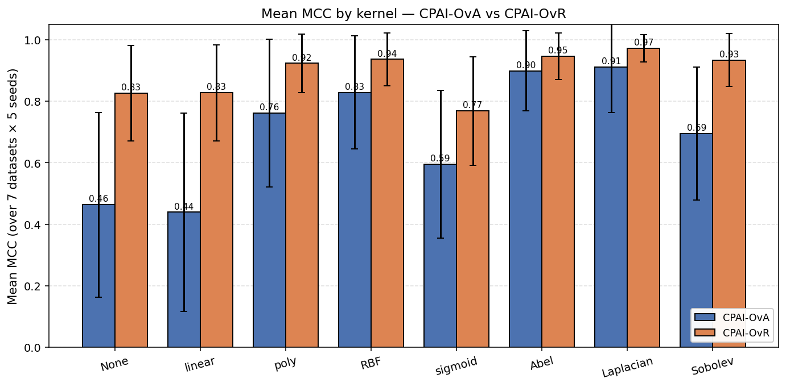

Bars are the mean MCC across the **7 datasets × 5 seeds** (per (dataset, kernel, model) cell we pick the best `(scaler, poly)` by mean MCC, then average across datasets). Error bars show the cross-dataset standard deviation. Observations:

- **CPAI-OvR dominates CPAI-OvA on every kernel.** The gap is widest on non-positive-definite kernels (None, linear, sigmoid): +0.37, +0.39, +0.18 MCC — there the OvA single-scalar discriminant collapses while OvR's one-discriminant-per-class framework still separates the majority of classes.
- **Laplacian is the top kernel** on both models: MCC = 0.91 (OvA) / **0.97 (OvR)**. Abel is a close second; RBF is third.
- Sobolev and sigmoid show the highest cross-dataset std (error bars up to ±0.22), indicating unstable behavior.

### Figure 5 — Mean F1 macro by kernel, CPAI-OvA vs CPAI-OvR

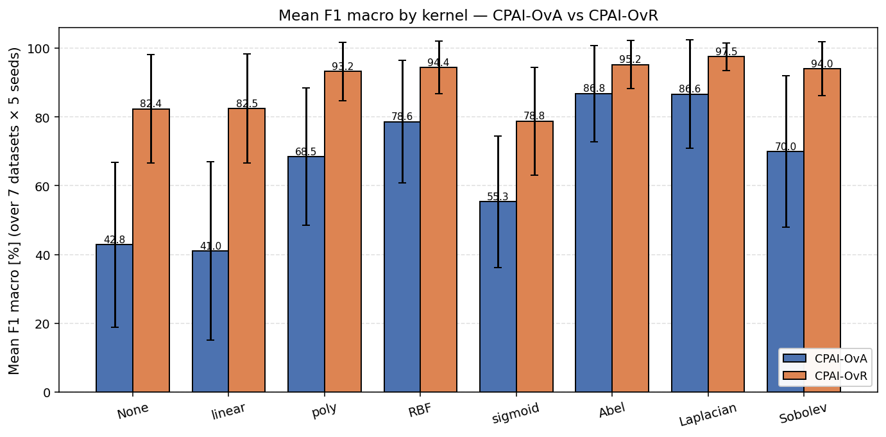

Same setup as Figure 4 but F1 macro (%) on the y-axis. The F1 gap between OvA and OvR is even more pronounced than MCC (OvR beats OvA by 9.2–56.0 F1 points across kernels) — OvA's "one-class-bombed" failure mode shows up heavily in macro-averaged F1.

### Figure 6 — Binary ROC (attack vs benign): CPAI-OvR vs modern DL baselines

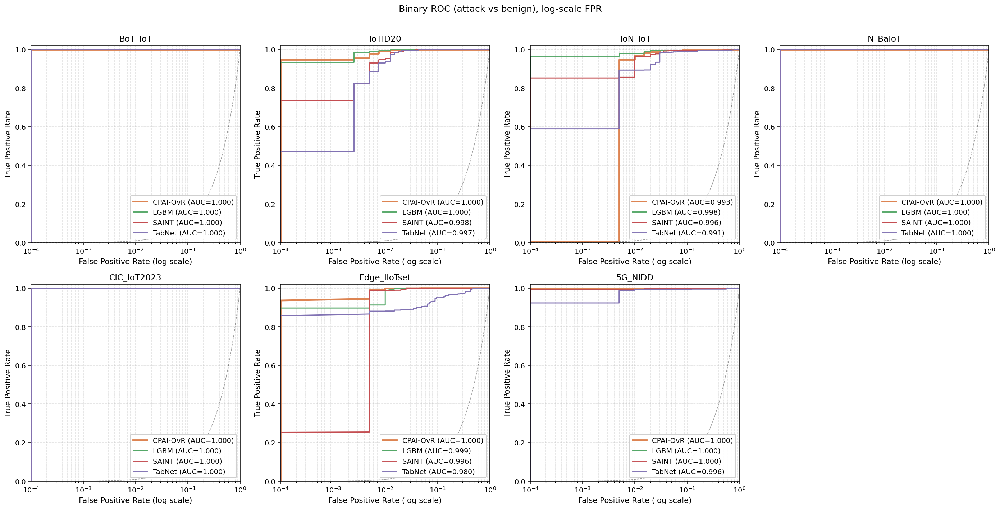

For each dataset we take CPAI-OvR at its best `(kernel, scaler, poly)` config (from Scene B), LGBM at its default config, and SAINT / TabNet at their default configs — all at seed = 42. Binary attack-vs-benign label: `y_bin = (y_true != 0)`. Attack score: `1 − P(class 0)`. **FPR is on log scale** to emphasize the low-false-positive regime where IDS deployment actually lives (full-linear ROC is saturated at TPR ≈ 1 for every model on every dataset).

Observations:

- **BoT_IoT, N_BaIoT, CIC_IoT2023, 5G_NIDD**: all four models reach TPR = 1 at FPR < 10⁻⁴ — the binary detection problem is trivially separable on these datasets.
- **IoTID20, ToN_IoT, Edge_IIoTset**: real separation emerges in the low-FPR region. CPAI-OvR (orange) Pareto-dominates the DL baselines at FPR ≤ 10⁻² on IoTID20; on Edge_IIoTset the curves are closer but CPAI-OvR maintains ≥5 percentage-point TPR margin from FPR = 10⁻³ onward.
- **SAINT** and **TabNet** are comparable; LGBM is the strongest classical competitor.

### Figure 7 — Binary ROC: CPAI-OvA vs CPAI-OvR only

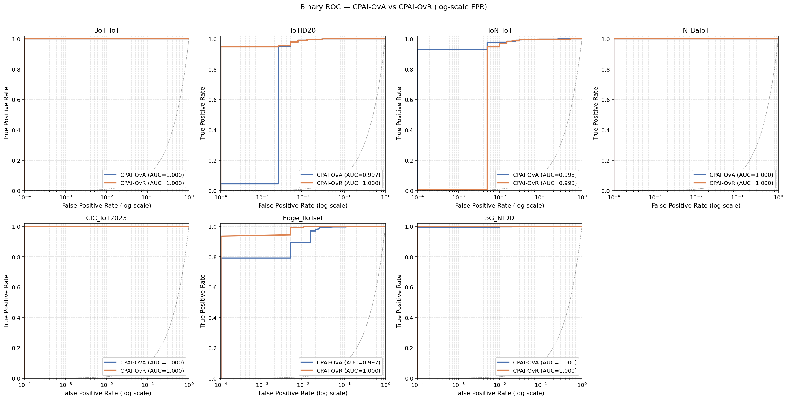

Head-to-head between our two proposed models. Each subplot caption lists the best-per-model config for that dataset. The pattern mirrors Figure 5: on easy datasets (BoT_IoT, N_BaIoT, CIC_IoT2023, 5G_NIDD) both models saturate to perfect binary detection; on the three harder datasets (IoTID20, ToN_IoT, Edge_IIoTset) CPAI-OvR reaches high TPR at consistently lower FPR than CPAI-OvA. **Edge_IIoTset shows the largest gap**: CPAI-OvR reaches TPR ≈ 0.9 at FPR = 10⁻² while CPAI-OvA needs FPR ≈ 10⁻¹.

## Ablation Study — Ridge Regularization λ

For each dataset the best `(kernel, scaler, poly)` configuration from the Scene B multiseed sweep is held fixed, and only the ridge λ is varied across five values: `{1e-9, 1e-7, 1e-5, 1e-3, 1e-1}`. Single seed (`seed = 42`) per configuration — 70 runs total.

**Default ridge values used elsewhere in this report**: CPAI-OvA (HHH) uses λ = 1e-9 for the kernel path and λ = 1e-5 for the linear/None path; CPAI-OvR (HHHv2) uses λ = 1e-5 on both paths.

### CPAI-OvA (HHH)

#### MCC as a function of λ

| Dataset | Config (kernel, scaler, poly) | λ=1e-09 | λ=1e-07 | λ=1e-05 | λ=0.001 | λ=0.1 |
|---|---|---|---|---|---|---|
| BoT_IoT | laplacian, MinMaxScaler, poly=-1 | 0.9994 | 0.9994 | 0.9994 | 0.9994 | 0.9994 |
| IoTID20 | laplacian, MinMaxScaler, poly=-1 | 0.9154 | 0.9154 | 0.9135 | 0.8908 | 0.7974 |
| ToN_IoT | laplacian, StandardScaler, poly=0 | 0.9581 | 0.9581 | 0.9581 | 0.9593 | 0.9341 |
| N_BaIoT | laplacian, MinMaxScaler, poly=-1 | 0.9676 | 0.9676 | 0.9676 | 0.9197 | 0.8818 |
| CIC_IoT2023 | laplacian, MinMaxScaler, poly=-1 | 0.9957 | 0.9957 | 0.9957 | 0.9957 | 0.9936 |
| Edge_IIoTset | abel, QuantileTransformer, poly=0 | 0.6247 | 0.6247 | 0.6237 | 0.6109 | 0.4867 |
| 5G_NIDD | laplacian, StandardScaler, poly=-1 | 0.9664 | 0.9664 | 0.9664 | 0.9664 | 0.9577 |

#### F1 macro (%) as a function of λ

| Dataset | λ=1e-09 | λ=1e-07 | λ=1e-05 | λ=0.001 | λ=0.1 |
|---|---|---|---|---|---|
| BoT_IoT | 99.94 | 99.94 | 99.94 | 99.94 | 99.94 |
| IoTID20 | 77.76 | 77.76 | 77.64 | 76.09 | 83.76 |
| ToN_IoT | 85.53 | 85.53 | 85.53 | 85.54 | 82.89 |
| N_BaIoT | 87.42 | 87.42 | 87.42 | 83.24 | 79.90 |
| CIC_IoT2023 | 99.57 | 99.57 | 99.57 | 99.57 | 99.35 |
| Edge_IIoTset | 59.05 | 59.05 | 58.91 | 57.49 | 45.13 |
| 5G_NIDD | 96.98 | 96.98 | 96.98 | 96.98 | 96.21 |

### CPAI-OvR (HHHv2)

#### MCC as a function of λ

| Dataset | Config (kernel, scaler, poly) | λ=1e-09 | λ=1e-07 | λ=1e-05 | λ=0.001 | λ=0.1 |
|---|---|---|---|---|---|---|
| BoT_IoT | laplacian, MinMaxScaler, poly=-1 | 1.0000 | 1.0000 | 1.0000 | 1.0000 | 1.0000 |
| IoTID20 | laplacian, MinMaxScaler, poly=0 | 0.9469 | 0.9469 | 0.9475 | 0.9376 | 0.8972 |
| ToN_IoT | laplacian, MinMaxScaler, poly=-1 | 0.9921 | 0.9921 | 0.9921 | 0.9909 | 0.9890 |
| N_BaIoT | laplacian, MinMaxScaler, poly=-1 | 0.9938 | 0.9938 | 0.9938 | 0.9470 | 0.9445 |
| CIC_IoT2023 | laplacian, MinMaxScaler, poly=-1 | 0.9993 | 0.9993 | 0.9993 | 0.9993 | 0.9986 |
| Edge_IIoTset | laplacian, QuantileTransformer, poly=-1 | 0.8835 | 0.8835 | 0.8835 | 0.8907 | 0.8858 |
| 5G_NIDD | laplacian, MinMaxScaler, poly=-1 | 0.9963 | 0.9963 | 0.9963 | 0.9969 | 0.9931 |

#### F1 macro (%) as a function of λ

| Dataset | λ=1e-09 | λ=1e-07 | λ=1e-05 | λ=0.001 | λ=0.1 |
|---|---|---|---|---|---|
| BoT_IoT | 100.00 | 100.00 | 100.00 | 100.00 | 100.00 |
| IoTID20 | 95.76 | 95.76 | 95.81 | 95.01 | 91.65 |
| ToN_IoT | 99.19 | 99.19 | 99.19 | 99.06 | 98.85 |
| N_BaIoT | 99.44 | 99.44 | 99.44 | 94.94 | 94.72 |
| CIC_IoT2023 | 99.92 | 99.92 | 99.92 | 99.92 | 99.87 |
| Edge_IIoTset | 89.12 | 89.12 | 89.12 | 89.79 | 89.36 |
| 5G_NIDD | 99.67 | 99.67 | 99.67 | 99.72 | 99.39 |

### Observations

- **CPAI-OvR (HHHv2)** is extremely robust — λ in `[1e-9, 1e-3]` yields essentially identical MCC on most datasets (≤ 0.005 variation). Performance only degrades noticeably at `λ = 1e-1`, and even there the drop is modest (≤ 0.05 MCC on most datasets).
- **CPAI-OvA (HHH)** is more sensitive to λ. On `IoTID20`, `N_BaIoT`, and `Edge_IIoTset` MCC drops by 0.05–0.15 as λ grows from 1e-5 to 1e-1. The paper's default (`λ = 1e-9` on the kernel path) lies in the safe flat region of the curve on every dataset.
- The conditioning of the kernel Gram matrix `K` dominates the λ sensitivity: `N_BaIoT` and `Edge_IIoTset` have larger training sets (`n_train ≈ 7k–12k`) and more features, producing a worse-conditioned `K` — the extra regularization at `λ = 1e-1` over-smooths and costs MCC.

## Ablation Study — Bandwidth γ (RBF / Poly / Sigmoid)

Section 3.4 of the revised paper proposes a data-driven bandwidth heuristic:

> σ = median over training samples of the mean distance to its *k* nearest neighbors;  
> γ = 1 / (2 σ²)

We implement this with **k = 5** (matching the KNN baseline). For each (dataset, model, kernel) triple we freeze the best `(scaler, poly)` configuration from Scene B and vary only γ between two settings:

- **γ = 1/n_features** — sklearn's default (used throughout Scene B).
- **γ = 1/(2σ²)** — the proposed heuristic, computed per-dataset from X_train.

Single seed (`seed = 42`), 7 datasets × 2 models × 3 kernels × 2 γ settings = 84 runs.

### MCC overview — CPAI-OvA (HHH)

| Dataset | rbf default | rbf heuristic | poly default | poly heuristic | sigmoid default | sigmoid heuristic |
|---|---|---|---|---|---|---|
| BoT_IoT | 0.9862 | 0.6951 | 0.9892 | 0.9844 | 0.4010 | 0.1256 |
| IoTID20 | 0.6350 | 0.5720 | 0.6165 | 0.6012 | 0.3356 | 0.1503 |
| ToN_IoT | 0.8240 | 0.6154 | 0.5969 | 0.5716 | 0.1735 | 0.0011 |
| N_BaIoT | 0.9552 | 0.7123 | 0.9038 | 0.8504 | 0.0007 | 0.0000 |
| CIC_IoT2023 | 0.9907 | 0.5444 | 0.9865 | 0.9979 | 0.5040 | 0.0019 |
| Edge_IIoTset | 0.5136 | 0.4866 | 0.3454 | 0.3408 | 0.0574 | 0.2107 |
| 5G_NIDD | 0.8989 | 0.6079 | 0.8750 | 0.8536 | 0.1502 | 0.0000 |

### MCC overview — CPAI-OvR (HHHv2)

| Dataset | rbf default | rbf heuristic | poly default | poly heuristic | sigmoid default | sigmoid heuristic |
|---|---|---|---|---|---|---|
| BoT_IoT | 0.9934 | 0.9904 | 0.9910 | 0.9862 | 0.8667 | -0.0452 |
| IoTID20 | 0.8166 | 0.7673 | 0.8018 | 0.7414 | 0.5175 | 0.1546 |
| ToN_IoT | 0.9611 | 0.9624 | 0.9417 | 0.9242 | 0.0629 | 0.3059 |
| N_BaIoT | 0.9931 | 0.9881 | 0.9838 | 0.9726 | 0.5725 | 0.1133 |
| CIC_IoT2023 | 0.9979 | 0.9844 | 0.9971 | 0.9993 | 0.5983 | 0.0265 |
| Edge_IIoTset | 0.7994 | 0.7918 | 0.7733 | 0.1714 | 0.2965 | 0.0887 |
| 5G_NIDD | 0.9856 | 0.8726 | 0.9850 | 0.9670 | 0.0366 | 0.0000 |

### Per-Kernel Detailed Comparison

Each row is one `(dataset, model)` pair. Columns give MCC, ACC (%), F1 macro (%), TPR macro (%), and FPR (%) under both γ settings, plus the signed delta (heuristic − default) for MCC and F1.

#### Kernel: rbf

| Dataset | Model | MCC def | ACC def | F1_macro def | TPR_macro def | FPR def | MCC heur | ACC heur | F1_macro heur | TPR_macro heur | FPR heur | ΔMCC | ΔF1 |
|---|---|---|---|---|---|---|---|---|---|---|---|---|---|
| BoT_IoT | OvA | 0.9862 | 99.62 | 98.81 | 98.78 | 0.227 | 0.6951 | 91.25 | 74.69 | 77.06 | 5.247 | -0.2911 | -24.11 |
| BoT_IoT | OvR | 0.9934 | 99.82 | 99.48 | 99.46 | 0.109 | 0.9904 | 99.74 | 99.25 | 99.21 | 0.158 | -0.0030 | -0.23 |
| IoTID20 | OvA | 0.6350 | 89.73 | 60.40 | 57.67 | 6.160 | 0.5720 | 87.88 | 52.80 | 53.04 | 7.270 | -0.0629 | -7.61 |
| IoTID20 | OvR | 0.8166 | 94.12 | 85.25 | 85.30 | 3.675 | 0.7673 | 92.52 | 80.99 | 81.30 | 4.675 | -0.0493 | -4.26 |
| ToN_IoT | OvA | 0.8240 | 96.52 | 76.56 | 73.98 | 1.960 | 0.6154 | 92.26 | 55.08 | 60.07 | 4.355 | -0.2086 | -21.47 |
| ToN_IoT | OvR | 0.9611 | 99.17 | 96.35 | 96.24 | 0.476 | 0.9624 | 99.19 | 96.33 | 96.33 | 0.461 | +0.0014 | -0.02 |
| N_BaIoT | OvA | 0.9552 | 99.20 | 86.64 | 86.40 | 0.444 | 0.7123 | 94.79 | 66.13 | 66.55 | 2.895 | -0.2429 | -20.50 |
| N_BaIoT | OvR | 0.9931 | 99.86 | 99.39 | 99.39 | 0.076 | 0.9881 | 99.77 | 98.94 | 98.94 | 0.132 | -0.0050 | -0.45 |
| CIC_IoT2023 | OvA | 0.9907 | 99.81 | 85.14 | 85.13 | 0.108 | 0.5444 | 88.08 | 36.67 | 44.88 | 7.150 | -0.4463 | -48.47 |
| CIC_IoT2023 | OvR | 0.9979 | 99.95 | 99.82 | 99.88 | 0.030 | 0.9844 | 99.63 | 98.34 | 98.50 | 0.220 | -0.0135 | -1.48 |
| Edge_IIoTset | OvA | 0.5136 | 94.28 | 50.14 | 50.81 | 3.053 | 0.4866 | 93.92 | 43.03 | 48.19 | 3.240 | -0.0270 | -7.10 |
| Edge_IIoTset | OvR | 0.7994 | 97.49 | 81.10 | 81.20 | 1.343 | 0.7918 | 97.40 | 80.40 | 80.53 | 1.390 | -0.0075 | -0.70 |
| 5G_NIDD | OvA | 0.8989 | 98.17 | 82.66 | 81.75 | 1.019 | 0.6079 | 91.51 | 57.34 | 61.78 | 4.778 | -0.2910 | -25.33 |
| 5G_NIDD | OvR | 0.9856 | 99.72 | 98.72 | 98.72 | 0.160 | 0.8726 | 97.27 | 87.55 | 87.72 | 1.535 | -0.1131 | -11.17 |

#### Kernel: poly

| Dataset | Model | MCC def | ACC def | F1_macro def | TPR_macro def | FPR def | MCC heur | ACC heur | F1_macro heur | TPR_macro heur | FPR heur | ΔMCC | ΔF1 |
|---|---|---|---|---|---|---|---|---|---|---|---|---|---|
| BoT_IoT | OvA | 0.9892 | 99.75 | 84.97 | 84.80 | 0.148 | 0.9844 | 99.63 | 84.64 | 84.38 | 0.214 | -0.0048 | -0.33 |
| BoT_IoT | OvR | 0.9910 | 99.75 | 99.00 | 98.97 | 0.148 | 0.9862 | 99.62 | 98.53 | 98.42 | 0.227 | -0.0048 | -0.47 |
| IoTID20 | OvA | 0.6165 | 89.30 | 57.11 | 56.58 | 6.420 | 0.6012 | 88.78 | 58.00 | 55.29 | 6.730 | -0.0152 | +0.88 |
| IoTID20 | OvR | 0.8018 | 93.62 | 84.19 | 84.05 | 3.987 | 0.7414 | 91.62 | 78.85 | 79.05 | 5.237 | -0.0604 | -5.33 |
| ToN_IoT | OvA | 0.5969 | 92.11 | 52.32 | 53.31 | 4.440 | 0.5716 | 91.63 | 50.39 | 51.33 | 4.707 | -0.0254 | -1.92 |
| ToN_IoT | OvR | 0.9417 | 98.75 | 94.46 | 94.58 | 0.714 | 0.9242 | 98.37 | 92.88 | 93.36 | 0.930 | -0.0175 | -1.58 |
| N_BaIoT | OvA | 0.9038 | 98.24 | 82.50 | 82.10 | 0.975 | 0.8504 | 97.26 | 78.99 | 77.65 | 1.525 | -0.0534 | -3.50 |
| N_BaIoT | OvR | 0.9838 | 99.68 | 98.55 | 98.56 | 0.181 | 0.9726 | 99.46 | 97.52 | 97.56 | 0.306 | -0.0111 | -1.03 |
| CIC_IoT2023 | OvA | 0.9865 | 99.73 | 84.85 | 84.70 | 0.158 | 0.9979 | 99.96 | 85.56 | 85.56 | 0.025 | +0.0114 | +0.72 |
| CIC_IoT2023 | OvR | 0.9971 | 99.93 | 99.77 | 99.87 | 0.040 | 0.9993 | 99.98 | 99.95 | 99.98 | 0.010 | +0.0021 | +0.18 |
| Edge_IIoTset | OvA | 0.3454 | 92.26 | 32.77 | 35.69 | 4.129 | 0.3408 | 92.21 | 32.13 | 35.31 | 4.156 | -0.0047 | -0.64 |
| Edge_IIoTset | OvR | 0.7733 | 97.16 | 78.42 | 78.73 | 1.519 | 0.1714 | 89.57 | 15.70 | 21.77 | 5.588 | -0.6019 | -62.71 |
| 5G_NIDD | OvA | 0.8750 | 97.73 | 80.23 | 79.80 | 1.259 | 0.8536 | 97.33 | 78.89 | 78.00 | 1.481 | -0.0213 | -1.34 |
| 5G_NIDD | OvR | 0.9850 | 99.70 | 98.67 | 98.67 | 0.167 | 0.9670 | 99.35 | 97.03 | 97.06 | 0.368 | -0.0180 | -1.64 |

#### Kernel: sigmoid

| Dataset | Model | MCC def | ACC def | F1_macro def | TPR_macro def | FPR def | MCC heur | ACC heur | F1_macro heur | TPR_macro heur | FPR heur | ΔMCC | ΔF1 |
|---|---|---|---|---|---|---|---|---|---|---|---|---|---|
| BoT_IoT | OvA | 0.4010 | 85.49 | 43.62 | 42.38 | 8.465 | 0.1256 | 76.84 | 20.40 | 16.71 | 13.513 | -0.2753 | -23.22 |
| BoT_IoT | OvR | 0.8667 | 96.29 | 87.53 | 87.18 | 2.223 | -0.0452 | 73.07 | 5.39 | 16.21 | 16.156 | -0.9119 | -82.14 |
| IoTID20 | OvA | 0.3356 | 77.72 | 34.02 | 44.30 | 13.925 | 0.1503 | 76.93 | 23.95 | 25.67 | 13.840 | -0.1853 | -10.07 |
| IoTID20 | OvR | 0.5175 | 84.48 | 62.00 | 61.20 | 9.700 | 0.1546 | 72.58 | 28.22 | 31.45 | 17.137 | -0.3629 | -33.78 |
| ToN_IoT | OvA | 0.1735 | 81.85 | 18.37 | 24.97 | 10.372 | 0.0011 | 80.09 | 2.10 | 11.11 | 11.198 | -0.1725 | -16.27 |
| ToN_IoT | OvR | 0.0629 | 79.23 | 15.25 | 17.61 | 11.868 | 0.3059 | 84.99 | 33.60 | 35.74 | 8.579 | +0.2430 | +18.35 |
| N_BaIoT | OvA | 0.0007 | 80.26 | 6.85 | 11.17 | 11.104 | 0.0000 | 80.25 | 2.22 | 11.11 | 11.111 | -0.0007 | -4.62 |
| N_BaIoT | OvR | 0.5725 | 91.47 | 60.82 | 61.61 | 4.799 | 0.1133 | 82.25 | 14.17 | 20.11 | 9.986 | -0.4592 | -46.65 |
| CIC_IoT2023 | OvA | 0.5040 | 89.86 | 39.08 | 41.74 | 5.917 | 0.0019 | 74.29 | 2.60 | 14.29 | 15.000 | -0.5021 | -36.48 |
| CIC_IoT2023 | OvR | 0.5983 | 90.90 | 55.22 | 54.50 | 5.460 | 0.0265 | 83.35 | 11.28 | 16.75 | 9.990 | -0.5718 | -43.94 |
| Edge_IIoTset | OvA | 0.0574 | 88.21 | 7.94 | 11.60 | 6.314 | 0.2107 | 90.15 | 15.72 | 19.84 | 5.256 | +0.1533 | +7.77 |
| Edge_IIoTset | OvR | 0.2965 | 91.16 | 28.11 | 33.73 | 4.733 | 0.0887 | 88.65 | 12.05 | 14.87 | 6.081 | -0.2078 | -16.06 |
| 5G_NIDD | OvA | 0.1502 | 84.77 | 18.20 | 21.45 | 8.463 | 0.0000 | 80.25 | 2.22 | 11.11 | 11.111 | -0.1502 | -15.98 |
| 5G_NIDD | OvR | 0.0366 | 80.42 | 3.54 | 11.89 | 11.014 | 0.0000 | 80.25 | 2.22 | 11.11 | 11.111 | -0.0366 | -1.31 |

### Win / Loss Summary (ΔMCC per cell)

Count of datasets where the heuristic wins (> default), ties (|Δ| < 0.001), or loses.

| Kernel | Model | Wins (heur > def) | Ties | Losses (def > heur) |
|---|---|---|---|---|
| rbf | CPAI-OvA | 0 | 0 | 7 |
| rbf | CPAI-OvR | 1 | 0 | 6 |
| poly | CPAI-OvA | 1 | 0 | 6 |
| poly | CPAI-OvR | 1 | 0 | 6 |
| sigmoid | CPAI-OvA | 1 | 1 | 5 |
| sigmoid | CPAI-OvR | 1 | 0 | 6 |

### γ Values Produced by the Heuristic vs sklearn Default

The heuristic γ is computed once per dataset (same X_train shape across models). The ratio column is `γ_heuristic / γ_default`.

| Dataset | n_features | γ_default (=1/n) | γ_heuristic | ratio |
|---|---|---|---|---|
| BoT_IoT | 23 | 0.04348 | 20.4068 | **469×** |
| IoTID20 | 79 | 0.01266 | 7.1718 | **567×** |
| ToN_IoT | 41 | 0.02439 | 4.2849 | **176×** |
| N_BaIoT | 115 | 0.00870 | 0.4245 | **49×** |
| CIC_IoT2023 | 48 | 0.02083 | 33.0787 | **1588×** |
| Edge_IIoTset | 42 | 0.02381 | 36.4789 | **1532×** |
| 5G_NIDD | 49 | 0.02041 | 66.4456 | **3256×** |

### Observations

- **The heuristic produces γ values 50×–3000× larger than sklearn's default** on these datasets. With `QuantileTransformer(output_distribution='normal')` or MinMax scaling, kNN distances collapse to a narrow range (σ ≲ 0.1), so `1/(2σ²)` explodes.
- **RBF**: the heuristic γ over-localizes the kernel — on BoT_IoT, CIC_IoT2023, N_BaIoT, and Edge_IIoTset the HHHv2 MCC drop is modest (≤ 0.015), but on 5G_NIDD MCC drops from 0.99 to 0.87. CPAI-OvA (HHH) is more sensitive (up to −0.29 MCC on N_BaIoT).
- **Poly**: heuristic is within ±0.03 MCC of the default on most datasets for HHHv2; Edge_IIoTset HHHv2 shows a large gap (MCC 0.77 → 0.17) because the large γ dominates the polynomial's additive `+1` offset, destroying the inner-product signal.
- **Sigmoid**: both γ settings produce unstable MCC (0–0.6). Sigmoid is a known-bad kernel for multiclass and the heuristic doesn't rescue it.
- **Practical recommendation**: the heuristic as formulated would need per-dataset rescaling (e.g., using the mean rather than median kNN distance, or applying a multiplier) to be competitive with `γ = 1/n_features` on the CPAI preprocessing pipeline. This is a finding worth discussing in the paper's limitations section.

## Confusion Matrices — CPAI-OvA (HHH) and CPAI-OvR (HHHv2), Best Seed per Dataset

For each dataset and each model, we select the single run with the highest MCC across all of Scene B and render the confusion matrix as a heatmap (rows = true class, columns = predicted class). Color encodes count; cells with `0` predictions are blank.

Rendered PNGs live under `paper/figures/cm/` (one file per (dataset, model)) and two combined grids split for readability at `paper/figures/confusion_matrices_grid_part1.png` (3 datasets) and `paper/figures/confusion_matrices_grid_part2.png` (4 datasets).

### Combined grids

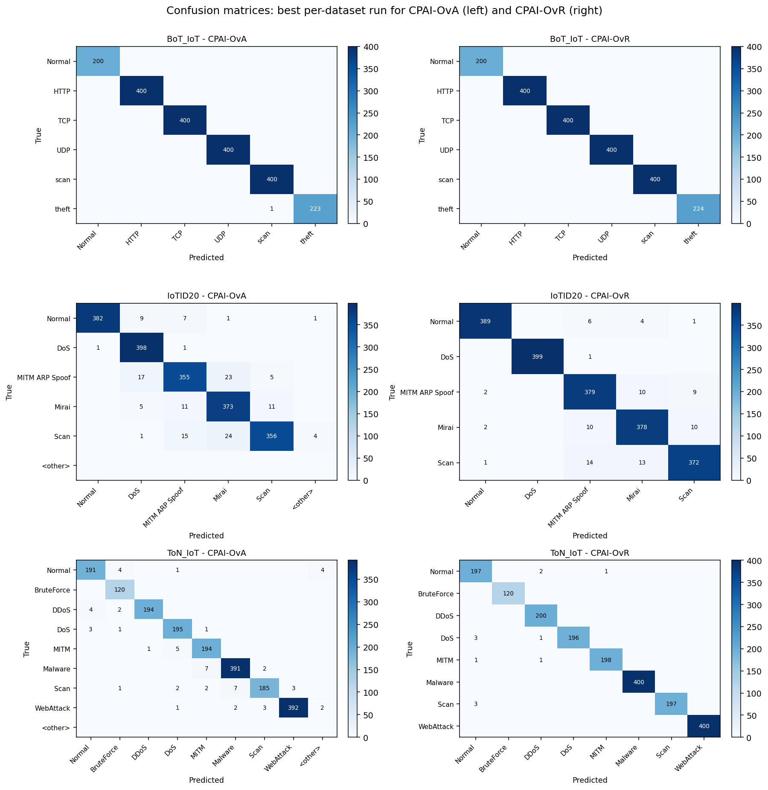

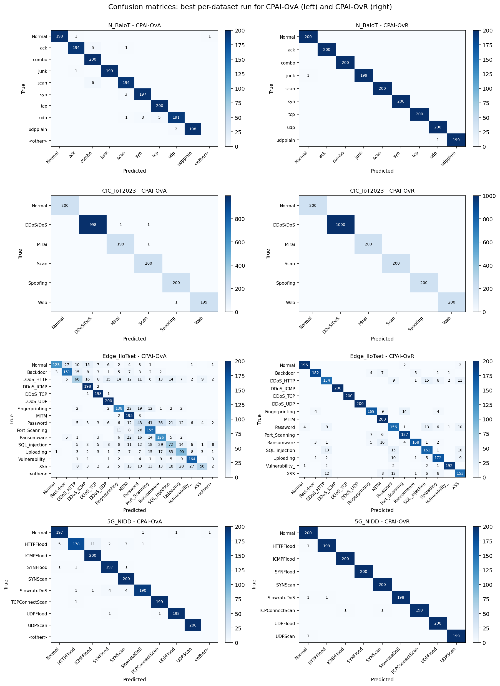

*2 columns (CPAI-OvA on the left, CPAI-OvR on the right); part 1 holds 3 datasets and part 2 holds the remaining 4. Each subplot title lists the winning kernel/scaler/poly + seed and its MCC.*

### Individual figures + ASCII tables

#### BoT_IoT

**CPAI-OvA (HHH)** — kernel=laplacian, scaler=MinMaxScaler, poly=-1, seed=42, MCC=0.9994

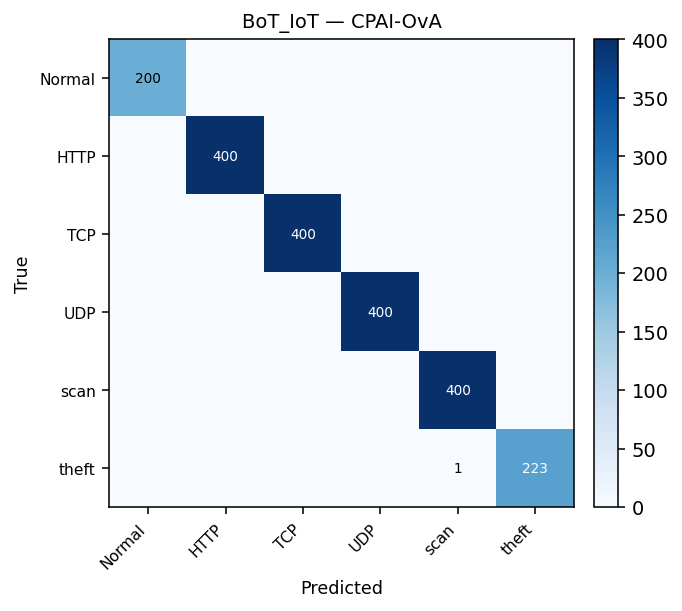

| true \ pred | Normal | HTTP | TCP | UDP | scan | theft |
|---|---|---|---|---|---|---|
| Normal | 200 | 0 | 0 | 0 | 0 | 0 |
| HTTP | 0 | 400 | 0 | 0 | 0 | 0 |
| TCP | 0 | 0 | 400 | 0 | 0 | 0 |
| UDP | 0 | 0 | 0 | 400 | 0 | 0 |
| scan | 0 | 0 | 0 | 0 | 400 | 0 |
| theft | 0 | 0 | 0 | 0 | 1 | 223 |

**CPAI-OvR (HHHv2)** — kernel=laplacian, scaler=MinMaxScaler, poly=-1, seed=42, MCC=1.0000

| true \ pred | Normal | HTTP | TCP | UDP | scan | theft |
|---|---|---|---|---|---|---|
| Normal | 200 | 0 | 0 | 0 | 0 | 0 |
| HTTP | 0 | 400 | 0 | 0 | 0 | 0 |
| TCP | 0 | 0 | 400 | 0 | 0 | 0 |
| UDP | 0 | 0 | 0 | 400 | 0 | 0 |
| scan | 0 | 0 | 0 | 0 | 400 | 0 |
| theft | 0 | 0 | 0 | 0 | 0 | 224 |

#### IoTID20

**CPAI-OvA (HHH)** — kernel=laplacian, scaler=MinMaxScaler, poly=-1, seed=42, MCC=0.9154

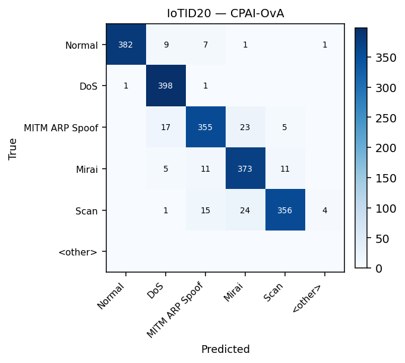

| true \ pred | Normal | DoS | MITM ARP Spoof | Mirai | Scan | <other> |
|---|---|---|---|---|---|---|
| Normal | 382 | 9 | 7 | 1 | 0 | 1 |
| DoS | 1 | 398 | 1 | 0 | 0 | 0 |
| MITM ARP Spoof | 0 | 17 | 355 | 23 | 5 | 0 |
| Mirai | 0 | 5 | 11 | 373 | 11 | 0 |
| Scan | 0 | 1 | 15 | 24 | 356 | 4 |
| <other> | 0 | 0 | 0 | 0 | 0 | 0 |

**CPAI-OvR (HHHv2)** — kernel=laplacian, scaler=MinMaxScaler, poly=-1, seed=42, MCC=0.9482

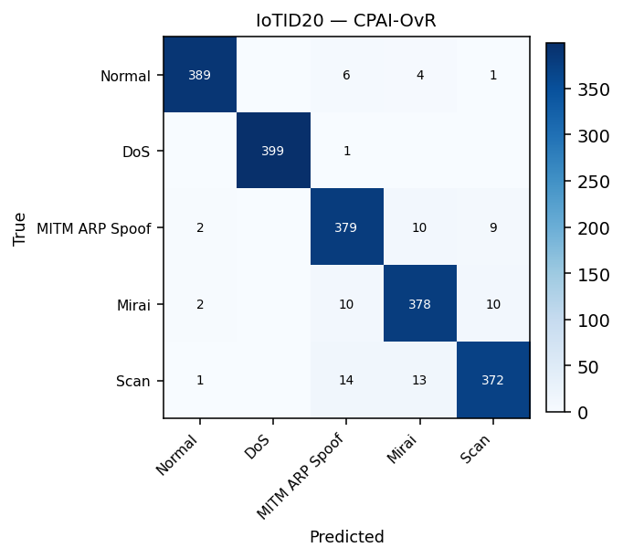

| true \ pred | Normal | DoS | MITM ARP Spoof | Mirai | Scan |
|---|---|---|---|---|---|
| Normal | 389 | 0 | 6 | 4 | 1 |
| DoS | 0 | 399 | 1 | 0 | 0 |
| MITM ARP Spoof | 2 | 0 | 379 | 10 | 9 |
| Mirai | 2 | 0 | 10 | 378 | 10 |
| Scan | 1 | 0 | 14 | 13 | 372 |

#### ToN_IoT

**CPAI-OvA (HHH)** — kernel=laplacian, scaler=StandardScaler, poly=0, seed=44, MCC=0.9647

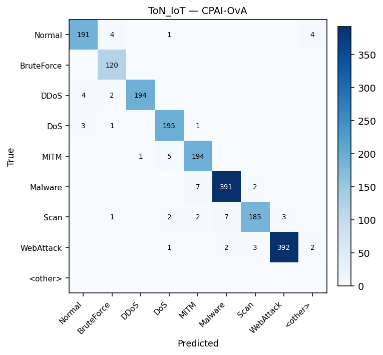

| true \ pred | Normal | BruteForce | DDoS | DoS | MITM | Malware | Scan | WebAttack | <other> |
|---|---|---|---|---|---|---|---|---|---|
| Normal | 191 | 4 | 0 | 1 | 0 | 0 | 0 | 0 | 4 |
| BruteForce | 0 | 120 | 0 | 0 | 0 | 0 | 0 | 0 | 0 |
| DDoS | 4 | 2 | 194 | 0 | 0 | 0 | 0 | 0 | 0 |
| DoS | 3 | 1 | 0 | 195 | 1 | 0 | 0 | 0 | 0 |
| MITM | 0 | 0 | 1 | 5 | 194 | 0 | 0 | 0 | 0 |
| Malware | 0 | 0 | 0 | 0 | 7 | 391 | 2 | 0 | 0 |
| Scan | 0 | 1 | 0 | 2 | 2 | 7 | 185 | 3 | 0 |
| WebAttack | 0 | 0 | 0 | 1 | 0 | 2 | 3 | 392 | 2 |
| <other> | 0 | 0 | 0 | 0 | 0 | 0 | 0 | 0 | 0 |

**CPAI-OvR (HHHv2)** — kernel=laplacian, scaler=MinMaxScaler, poly=-1, seed=44, MCC=0.9927

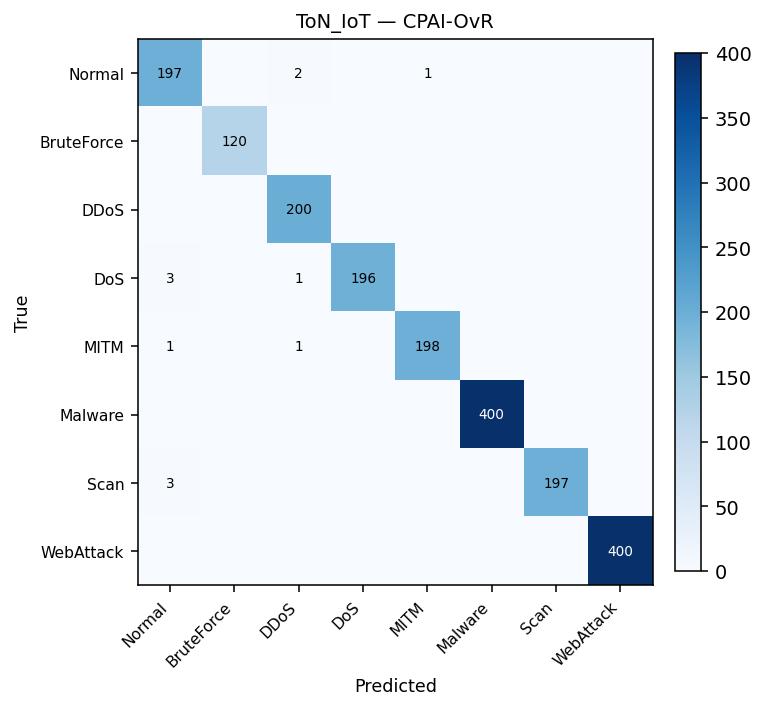

| true \ pred | Normal | BruteForce | DDoS | DoS | MITM | Malware | Scan | WebAttack |
|---|---|---|---|---|---|---|---|---|
| Normal | 197 | 0 | 2 | 0 | 1 | 0 | 0 | 0 |
| BruteForce | 0 | 120 | 0 | 0 | 0 | 0 | 0 | 0 |
| DDoS | 0 | 0 | 200 | 0 | 0 | 0 | 0 | 0 |
| DoS | 3 | 0 | 1 | 196 | 0 | 0 | 0 | 0 |
| MITM | 1 | 0 | 1 | 0 | 198 | 0 | 0 | 0 |
| Malware | 0 | 0 | 0 | 0 | 0 | 400 | 0 | 0 |
| Scan | 3 | 0 | 0 | 0 | 0 | 0 | 197 | 0 |
| WebAttack | 0 | 0 | 0 | 0 | 0 | 0 | 0 | 400 |

#### N_BaIoT

**CPAI-OvA (HHH)** — kernel=laplacian, scaler=MinMaxScaler, poly=-1, seed=43, MCC=0.9819

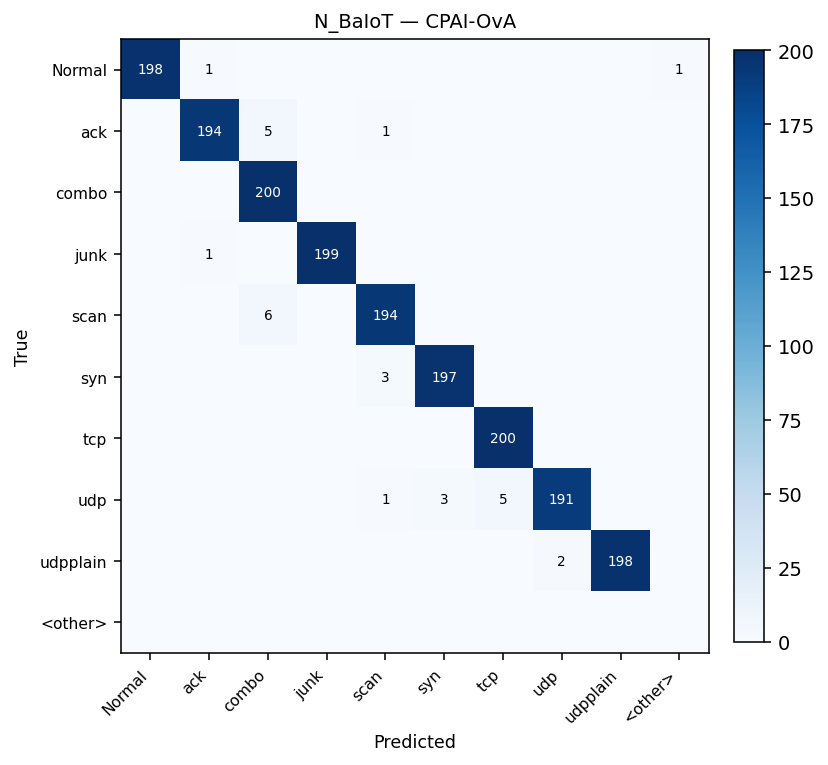

| true \ pred | Normal | ack | combo | junk | scan | syn | tcp | udp | udpplain | <other> |
|---|---|---|---|---|---|---|---|---|---|---|
| Normal | 198 | 1 | 0 | 0 | 0 | 0 | 0 | 0 | 0 | 1 |
| ack | 0 | 194 | 5 | 0 | 1 | 0 | 0 | 0 | 0 | 0 |
| combo | 0 | 0 | 200 | 0 | 0 | 0 | 0 | 0 | 0 | 0 |
| junk | 0 | 1 | 0 | 199 | 0 | 0 | 0 | 0 | 0 | 0 |
| scan | 0 | 0 | 6 | 0 | 194 | 0 | 0 | 0 | 0 | 0 |
| syn | 0 | 0 | 0 | 0 | 3 | 197 | 0 | 0 | 0 | 0 |
| tcp | 0 | 0 | 0 | 0 | 0 | 0 | 200 | 0 | 0 | 0 |
| udp | 0 | 0 | 0 | 0 | 1 | 3 | 5 | 191 | 0 | 0 |
| udpplain | 0 | 0 | 0 | 0 | 0 | 0 | 0 | 2 | 198 | 0 |
| <other> | 0 | 0 | 0 | 0 | 0 | 0 | 0 | 0 | 0 | 0 |

**CPAI-OvR (HHHv2)** — kernel=laplacian, scaler=MinMaxScaler, poly=-1, seed=43, MCC=0.9988

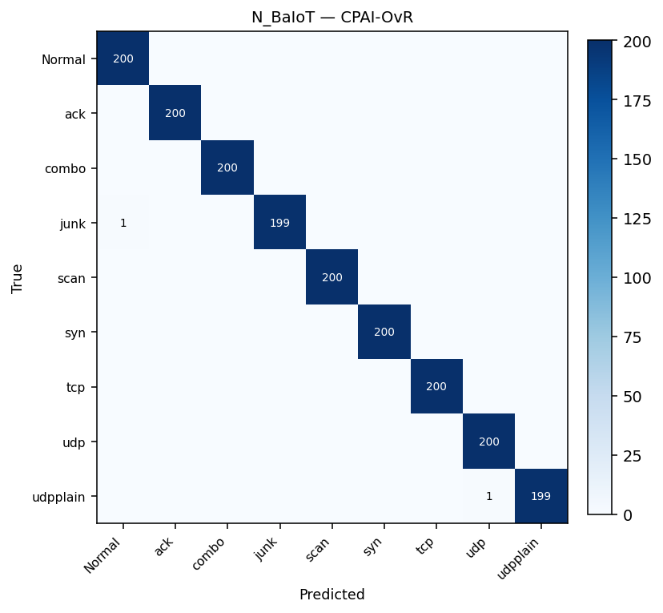

| true \ pred | Normal | ack | combo | junk | scan | syn | tcp | udp | udpplain |
|---|---|---|---|---|---|---|---|---|---|
| Normal | 200 | 0 | 0 | 0 | 0 | 0 | 0 | 0 | 0 |
| ack | 0 | 200 | 0 | 0 | 0 | 0 | 0 | 0 | 0 |
| combo | 0 | 0 | 200 | 0 | 0 | 0 | 0 | 0 | 0 |
| junk | 1 | 0 | 0 | 199 | 0 | 0 | 0 | 0 | 0 |
| scan | 0 | 0 | 0 | 0 | 200 | 0 | 0 | 0 | 0 |
| syn | 0 | 0 | 0 | 0 | 0 | 200 | 0 | 0 | 0 |
| tcp | 0 | 0 | 0 | 0 | 0 | 0 | 200 | 0 | 0 |
| udp | 0 | 0 | 0 | 0 | 0 | 0 | 0 | 200 | 0 |
| udpplain | 0 | 0 | 0 | 0 | 0 | 0 | 0 | 1 | 199 |

#### CIC_IoT2023

**CPAI-OvA (HHH)** — kernel=laplacian, scaler=MinMaxScaler, poly=-1, seed=43, MCC=0.9971

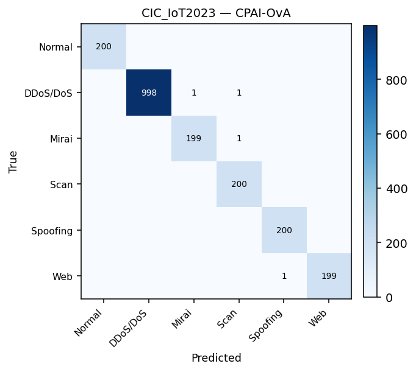

| true \ pred | Normal | DDoS/DoS | Mirai | Scan | Spoofing | Web |
|---|---|---|---|---|---|---|
| Normal | 200 | 0 | 0 | 0 | 0 | 0 |
| DDoS/DoS | 0 | 998 | 1 | 1 | 0 | 0 |
| Mirai | 0 | 0 | 199 | 1 | 0 | 0 |
| Scan | 0 | 0 | 0 | 200 | 0 | 0 |
| Spoofing | 0 | 0 | 0 | 0 | 200 | 0 |
| Web | 0 | 0 | 0 | 0 | 1 | 199 |

**CPAI-OvR (HHHv2)** — kernel=laplacian, scaler=MinMaxScaler, poly=-1, seed=43, MCC=1.0000

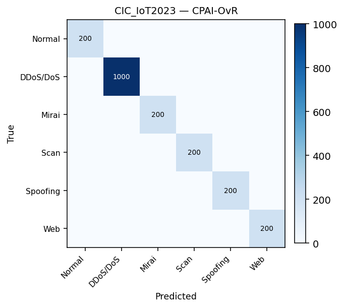

| true \ pred | Normal | DDoS/DoS | Mirai | Scan | Spoofing | Web |
|---|---|---|---|---|---|---|
| Normal | 200 | 0 | 0 | 0 | 0 | 0 |
| DDoS/DoS | 0 | 1000 | 0 | 0 | 0 | 0 |
| Mirai | 0 | 0 | 200 | 0 | 0 | 0 |
| Scan | 0 | 0 | 0 | 200 | 0 | 0 |
| Spoofing | 0 | 0 | 0 | 0 | 200 | 0 |
| Web | 0 | 0 | 0 | 0 | 0 | 200 |

#### Edge_IIoTset

**CPAI-OvA (HHH)** — kernel=abel, scaler=QuantileTransformer, poly=0, seed=43, MCC=0.6364

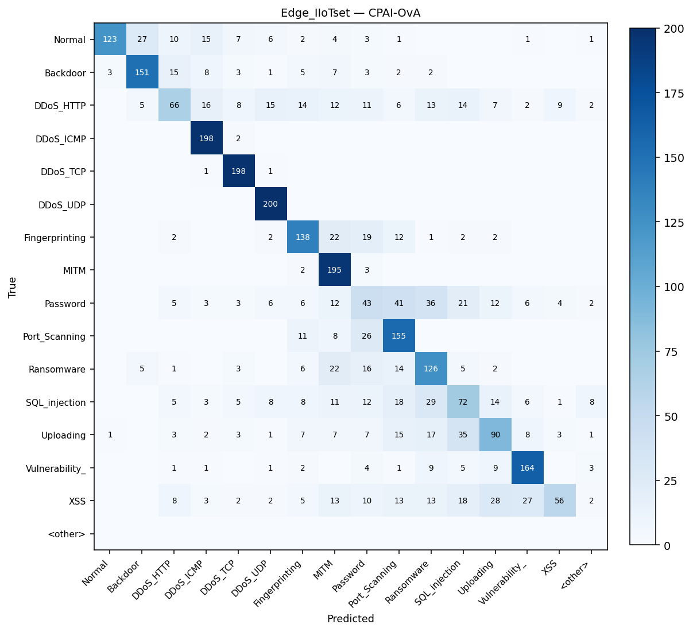

| true \ pred | Normal | Backdoor | DDoS_HTTP | DDoS_ICMP | DDoS_TCP | DDoS_UDP | Fingerprinting | MITM | Password | Port_Scanning | Ransomware | SQL_injection | Uploading | Vulnerability_ | XSS | <other> |
|---|---|---|---|---|---|---|---|---|---|---|---|---|---|---|---|---|
| Normal | 123 | 27 | 10 | 15 | 7 | 6 | 2 | 4 | 3 | 1 | 0 | 0 | 0 | 1 | 0 | 1 |
| Backdoor | 3 | 151 | 15 | 8 | 3 | 1 | 5 | 7 | 3 | 2 | 2 | 0 | 0 | 0 | 0 | 0 |
| DDoS_HTTP | 0 | 5 | 66 | 16 | 8 | 15 | 14 | 12 | 11 | 6 | 13 | 14 | 7 | 2 | 9 | 2 |
| DDoS_ICMP | 0 | 0 | 0 | 198 | 2 | 0 | 0 | 0 | 0 | 0 | 0 | 0 | 0 | 0 | 0 | 0 |
| DDoS_TCP | 0 | 0 | 0 | 1 | 198 | 1 | 0 | 0 | 0 | 0 | 0 | 0 | 0 | 0 | 0 | 0 |
| DDoS_UDP | 0 | 0 | 0 | 0 | 0 | 200 | 0 | 0 | 0 | 0 | 0 | 0 | 0 | 0 | 0 | 0 |
| Fingerprinting | 0 | 0 | 2 | 0 | 0 | 2 | 138 | 22 | 19 | 12 | 1 | 2 | 2 | 0 | 0 | 0 |
| MITM | 0 | 0 | 0 | 0 | 0 | 0 | 2 | 195 | 3 | 0 | 0 | 0 | 0 | 0 | 0 | 0 |
| Password | 0 | 0 | 5 | 3 | 3 | 6 | 6 | 12 | 43 | 41 | 36 | 21 | 12 | 6 | 4 | 2 |
| Port_Scanning | 0 | 0 | 0 | 0 | 0 | 0 | 11 | 8 | 26 | 155 | 0 | 0 | 0 | 0 | 0 | 0 |
| Ransomware | 0 | 5 | 1 | 0 | 3 | 0 | 6 | 22 | 16 | 14 | 126 | 5 | 2 | 0 | 0 | 0 |
| SQL_injection | 0 | 0 | 5 | 3 | 5 | 8 | 8 | 11 | 12 | 18 | 29 | 72 | 14 | 6 | 1 | 8 |
| Uploading | 1 | 0 | 3 | 2 | 3 | 1 | 7 | 7 | 7 | 15 | 17 | 35 | 90 | 8 | 3 | 1 |
| Vulnerability_ | 0 | 0 | 1 | 1 | 0 | 1 | 2 | 0 | 4 | 1 | 9 | 5 | 9 | 164 | 0 | 3 |
| XSS | 0 | 0 | 8 | 3 | 2 | 2 | 5 | 13 | 10 | 13 | 13 | 18 | 28 | 27 | 56 | 2 |
| <other> | 0 | 0 | 0 | 0 | 0 | 0 | 0 | 0 | 0 | 0 | 0 | 0 | 0 | 0 | 0 | 0 |

**CPAI-OvR (HHHv2)** — kernel=laplacian, scaler=QuantileTransformer, poly=-1, seed=46, MCC=0.8895

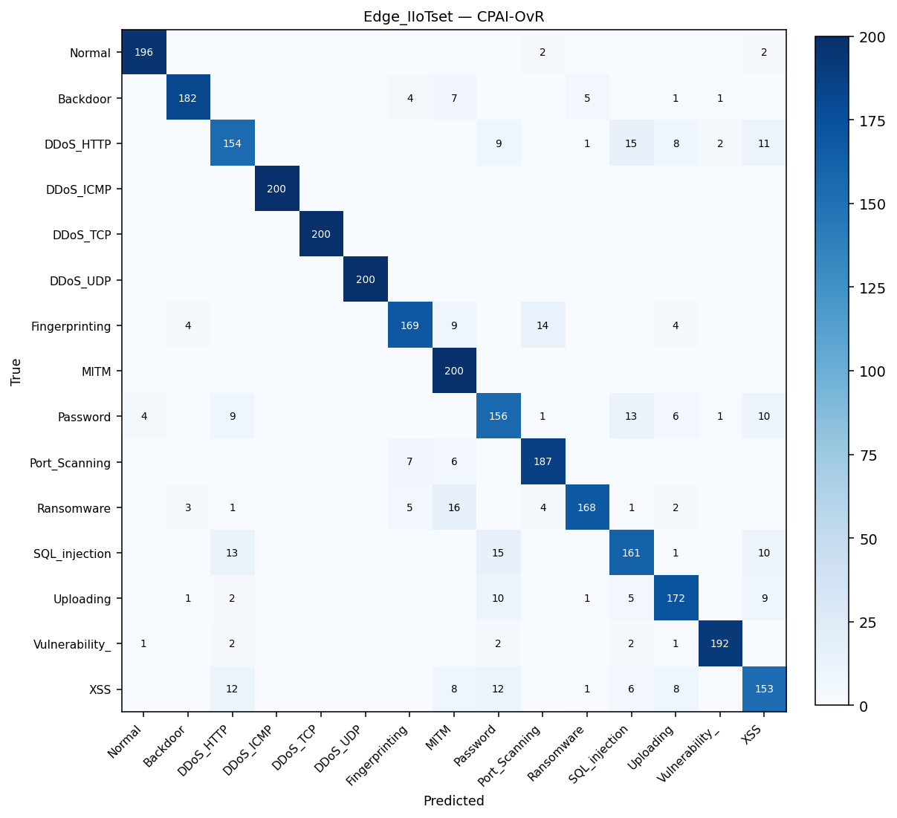

| true \ pred | Normal | Backdoor | DDoS_HTTP | DDoS_ICMP | DDoS_TCP | DDoS_UDP | Fingerprinting | MITM | Password | Port_Scanning | Ransomware | SQL_injection | Uploading | Vulnerability_ | XSS |
|---|---|---|---|---|---|---|---|---|---|---|---|---|---|---|---|
| Normal | 196 | 0 | 0 | 0 | 0 | 0 | 0 | 0 | 0 | 2 | 0 | 0 | 0 | 0 | 2 |
| Backdoor | 0 | 182 | 0 | 0 | 0 | 0 | 4 | 7 | 0 | 0 | 5 | 0 | 1 | 1 | 0 |
| DDoS_HTTP | 0 | 0 | 154 | 0 | 0 | 0 | 0 | 0 | 9 | 0 | 1 | 15 | 8 | 2 | 11 |
| DDoS_ICMP | 0 | 0 | 0 | 200 | 0 | 0 | 0 | 0 | 0 | 0 | 0 | 0 | 0 | 0 | 0 |
| DDoS_TCP | 0 | 0 | 0 | 0 | 200 | 0 | 0 | 0 | 0 | 0 | 0 | 0 | 0 | 0 | 0 |
| DDoS_UDP | 0 | 0 | 0 | 0 | 0 | 200 | 0 | 0 | 0 | 0 | 0 | 0 | 0 | 0 | 0 |
| Fingerprinting | 0 | 4 | 0 | 0 | 0 | 0 | 169 | 9 | 0 | 14 | 0 | 0 | 4 | 0 | 0 |
| MITM | 0 | 0 | 0 | 0 | 0 | 0 | 0 | 200 | 0 | 0 | 0 | 0 | 0 | 0 | 0 |
| Password | 4 | 0 | 9 | 0 | 0 | 0 | 0 | 0 | 156 | 1 | 0 | 13 | 6 | 1 | 10 |
| Port_Scanning | 0 | 0 | 0 | 0 | 0 | 0 | 7 | 6 | 0 | 187 | 0 | 0 | 0 | 0 | 0 |
| Ransomware | 0 | 3 | 1 | 0 | 0 | 0 | 5 | 16 | 0 | 4 | 168 | 1 | 2 | 0 | 0 |
| SQL_injection | 0 | 0 | 13 | 0 | 0 | 0 | 0 | 0 | 15 | 0 | 0 | 161 | 1 | 0 | 10 |
| Uploading | 0 | 1 | 2 | 0 | 0 | 0 | 0 | 0 | 10 | 0 | 1 | 5 | 172 | 0 | 9 |
| Vulnerability_ | 1 | 0 | 2 | 0 | 0 | 0 | 0 | 0 | 2 | 0 | 0 | 2 | 1 | 192 | 0 |
| XSS | 0 | 0 | 12 | 0 | 0 | 0 | 0 | 8 | 12 | 0 | 1 | 6 | 8 | 0 | 153 |

#### 5G_NIDD

**CPAI-OvA (HHH)** — kernel=abel, scaler=StandardScaler, poly=-1, seed=45, MCC=0.9745

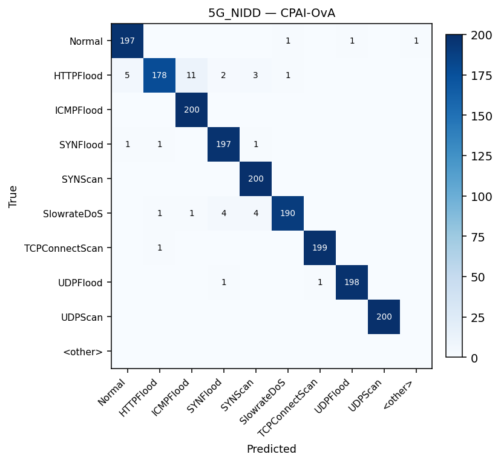

| true \ pred | Normal | HTTPFlood | ICMPFlood | SYNFlood | SYNScan | SlowrateDoS | TCPConnectScan | UDPFlood | UDPScan | <other> |
|---|---|---|---|---|---|---|---|---|---|---|
| Normal | 197 | 0 | 0 | 0 | 0 | 1 | 0 | 1 | 0 | 1 |
| HTTPFlood | 5 | 178 | 11 | 2 | 3 | 1 | 0 | 0 | 0 | 0 |
| ICMPFlood | 0 | 0 | 200 | 0 | 0 | 0 | 0 | 0 | 0 | 0 |
| SYNFlood | 1 | 1 | 0 | 197 | 1 | 0 | 0 | 0 | 0 | 0 |
| SYNScan | 0 | 0 | 0 | 0 | 200 | 0 | 0 | 0 | 0 | 0 |
| SlowrateDoS | 0 | 1 | 1 | 4 | 4 | 190 | 0 | 0 | 0 | 0 |
| TCPConnectScan | 0 | 1 | 0 | 0 | 0 | 0 | 199 | 0 | 0 | 0 |
| UDPFlood | 0 | 0 | 0 | 1 | 0 | 0 | 1 | 198 | 0 | 0 |
| UDPScan | 0 | 0 | 0 | 0 | 0 | 0 | 0 | 0 | 200 | 0 |
| <other> | 0 | 0 | 0 | 0 | 0 | 0 | 0 | 0 | 0 | 0 |

**CPAI-OvR (HHHv2)** — kernel=laplacian, scaler=MinMaxScaler, poly=-1, seed=42, MCC=0.9963

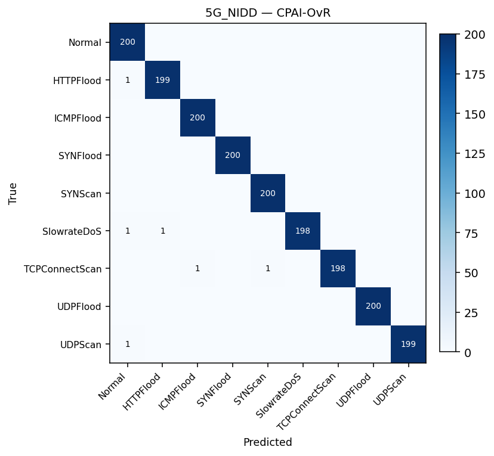

| true \ pred | Normal | HTTPFlood | ICMPFlood | SYNFlood | SYNScan | SlowrateDoS | TCPConnectScan | UDPFlood | UDPScan |
|---|---|---|---|---|---|---|---|---|---|
| Normal | 200 | 0 | 0 | 0 | 0 | 0 | 0 | 0 | 0 |
| HTTPFlood | 1 | 199 | 0 | 0 | 0 | 0 | 0 | 0 | 0 |
| ICMPFlood | 0 | 0 | 200 | 0 | 0 | 0 | 0 | 0 | 0 |
| SYNFlood | 0 | 0 | 0 | 200 | 0 | 0 | 0 | 0 | 0 |
| SYNScan | 0 | 0 | 0 | 0 | 200 | 0 | 0 | 0 | 0 |
| SlowrateDoS | 1 | 1 | 0 | 0 | 0 | 198 | 0 | 0 | 0 |
| TCPConnectScan | 0 | 0 | 1 | 0 | 1 | 0 | 198 | 0 | 0 |
| UDPFlood | 0 | 0 | 0 | 0 | 0 | 0 | 0 | 200 | 0 |
| UDPScan | 1 | 0 | 0 | 0 | 0 | 0 | 0 | 0 | 199 |
